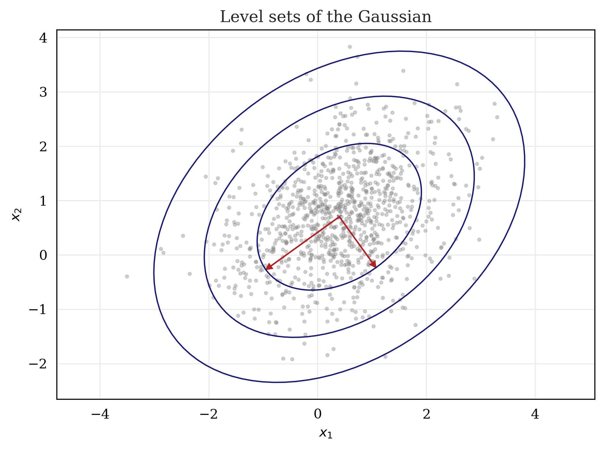
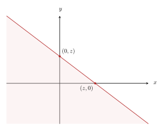
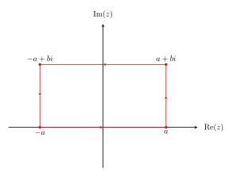

<style>
  details {
    border: 1px solid black;
    border-radius: 8px;
    padding: 0.5em 0.5em 0em;
    margin-bottom: 2em;
    margin-top: 2em;
  }
  
  summary {
    font-weight: bold;
    margin: -0.5em -0.5em 0;
    padding: 0.5em;
    cursor: pointer;
    border-bottom: 1px solid #aaa;
    border-radius: 8px 8px 0 0;
  }
  
  details[open] summary {
    border-bottom: 1px solid #aaa;
    margin-bottom: 0;
  }
  
  details p {
    padding-top: 0.1em;
  }
</style>

Despite its ubiquity, I have frequently found myself in a state somewhere between *discomfort* and *panic* each time I am faced with the task of manipulating the Gaussian distribution, particularly in multiple dimensions. So, I've taken the opportunity to work through some detailed derivations involving the Gaussian.

In this blog, I focus on the multivariate Gaussian distribution, beginning by reasoning about its shape and properties in high dimensions. Then, I derive some useful formulas such as conditioning, marginalization, and certain transformations. Many resources provide excellent discussions which focus on intuition and visualization behind the Gaussian distribution. My goal, however, is to provide detailed mathematical arguments which lead to common results.


## Properties

In this section, I'll start by considering some basic properties of the Gaussian distribution. First, I'll show that surfaces on which the likelihood is constant form ellipsoids. Then, we'll see that the multivariate Gaussian distribution is indeed normalized, making it a valid probability distribution. Finally, we'll consider the first- and second-order moments of the multivariate Gaussian distribution to provide an interpretation of its parameters.

We write the Gaussian distribution for a random vector $\x \in \R^d$ as

$$
\begin{equation*}
\Norm(\x \mid \bmu, \bSigma) = \frac{1}{(2\pi)^{d/2}\lvert \bSigma \rvert^{1/2}}\exp\left( -\frac{1}{2} (\x - \bmu)\T\bSigma\inv(\x - \bmu)\right),
\end{equation*}
$$

where $\bmu \in \R^d$ is the mean vector and $\bSigma \in \R^{d\times d}$ is the covariance matrix. Often, we choose to work with the quadratic form in the exponent, which we define

$$
\begin{equation}\label{1}
\Delta^2 = (\x - \bmu)\T\bSigma\inv(\x-\bmu).
\end{equation}
$$

$\Delta$ is called the *Mahalanobis distance*, and is analagous to the z-score of a univariate Gaussian random variable $X$:

$$
\begin{equation*}
Z = \frac{X - \mu}{\sigma}.
\end{equation*}
$$

The z-score measures the number of standard deviations $X$ is from the mean. Unlike the z-score, however, the Mahalanobis distance depends on the *dimension*; one unit in Euclidean distance from the mean in one direction may not be the same as one unit distance in another direction, in terms of $\Delta$, since the variance along one dimension of $\x$ may be different than that along another. However, if $\bSigma$ is the identity matrix, then $\Delta$ is in fact equivalent to the Euclidean distance.

Since the covariance matrix $\bSigma$ is real and symmetric, we can perform [eigenvalue decomposition](#appendix) to write it in the form

$$
\begin{align*}
\bSigma &=  \U\bLambda\U\T \\\\
&=\sum_{i=1}^d\lambda_i\u_i\u_i\T.
\end{align*}
$$

Here, $\U$ is the matrix whose rows are given by $\u_i\T$, the eigenvectors of $\bSigma$, and $\bLambda = \diag(\lambda_1, \lambda_2, \ldots, \lambda_d)$ contains the corresponding eigenvalues. Note that we can choose the eigenvectors to be orthonormal, i.e., [^fn1]

$$
\begin{equation*}
\u_i\T\u_j = \delta_{ij}.
\end{equation*}
$$

Thus, $\U$ is an orthogonal matrix, so $\U\U\T = \I$, and $\U\T = \U\inv$. Moreover, we can easily write the inverse of the covariance matrix as

$$
\begin{equation*}
\bSigma\inv = \sum_{i=1}^d\frac{1}{\lambda_i}\u_i\u_i\T.
\end{equation*}
$$

Substituting this into $\eqref{1}$, we get

$$
\begin{align*}
\Delta^2 &= \sum_{i=1}^d \frac{1}{\lambda_i}(\x - \bmu)\T\u_i\u_i\T(\x - \bmu) \\\\[1pt]
&= \sum_{i=1}^d\frac{y_i^2}{\lambda_i},
\end{align*}
$$

where I've introduced

$$
\begin{equation*}
y_i = \u_i\T(\x - \bmu).
\end{equation*}
$$

The set $\\{y_i\\}$ can then be seen as a transformed coordinate system, shifted by $\bmu$ and rotated by $\U$.[^fn2] Alternatively, we can write this as a vector:

$$
\begin{equation}\label{2}
\y = \U(\x - \bmu).
\end{equation}
$$

Now, all of the dependence of the Gaussian on $\x$ is determined by $\Delta^2$. Thus, the Gaussian is constant on surfaces for which $\Delta^2$ is constant. Then, let

$$
\begin{equation*}
\Delta^2 = \sum_{i=1}^d\frac{y_i^2}{\lambda_i} = r
\end{equation*}
$$

for some constant $r$. This defines the equation of an ellipsoid in $d$ dimensions.  

<details>
<summary>Example: Level sets of the Gaussian</summary>
<p>
In the case of the univariate Gaussian distribution, we often like to talk about the probability that an observation will fall within some range of values. For example, we might like to know the probability that a random variable will fall within one standard deviation from the mean.

As an example, I'll consider the analagous case for a bivariate Gaussian, in which we would like to find the ellipses corresponding to the probabilities that a point falls within one, two, or three standard deviations from the mean.

First consider a univariate Gaussian random variable $X \sim \Norm(\mu, \sigma^2)$. The probability that $\X$ is within one standard deviation from the mean is given by

$$
\begin{align*}
P(\lvert X - \mu \rvert \leq \sigma) &= P(-\sigma \leq X - \mu \leq \sigma) \\\\
&= P(-1 \leq \frac{X - \mu}{\sigma} \leq 1) \\\\
&= P(-1 \leq Z \leq 1),
\end{align*}
$$

where $Z = \frac{X - \mu}{\sigma}$ is a standard Gaussian random variable. Then, this probability is given by

$$
\begin{align*}
P(-1 \leq Z \leq 1) &= P(Z \leq 1) - P(Z \leq -1) \\\\
&= \Phi(1) - \Phi(-1)
\end{align*}
$$

where $\Phi(\cdot)$ is the cdf of $Z$, for which the functional values are usually determined from a [table](https://engineering.purdue.edu/ChanGroup/ECE302/files/normal_cdf.pdf), or when in doubt, we can make computers think for us:

```python
from scipy.stats import norm

print(f"{norm.cdf(1) - norm.cdf(-1):.3f}")

0.683
```
  
We can do this in a similar fashion to find the probabilities that $X$ falls within $2\sigma$ or $3\sigma$ from the mean, for which the values are approximately $0.954$ and $0.997$, respectively.

In the multivariate case, we seek to find some constant $k$ for which

$$
\begin{equation*}
P(\Delta^2 \leq k^2) = 0.683,
\end{equation*}
$$

That is, the Mahalanobis distance for which the probability that a point $\x$ will be within this distance from the mean is $0.683$. To do so, we note that $\Delta^2$ follows a chi-squared distribution. To see this, recall the expression for $\Delta^2$:

$$
\begin{align*}
\Delta^2 &= (\x - \bmu)\T\U\T\bLambda\inv\U(\x - \bmu) \\\\
&= \y\T\bLambda\inv\y.
\end{align*}
$$

Then, $\y$ is a random vector with zero mean and diagonal covariance $\bLambda$. Since it has diagonal covariance, the elements of $\y$ are uncorrelated. In general, uncorrelated does not imply independence; however, it can be shown that, in the case of Gaussians, it does. Then, consider yet another transformation:
  
$$
\begin{equation*}
\z = \bLambda^{-1/2}\y,
\end{equation*}
$$

where $\bLambda^{-1/2} = \diag(\lambda_1^{-1/2}, \ldots, \lambda_d^{-1/2})$. The elements of $\z$ have been standardized, so $\z$ is a vector of standard Gaussian random variables. Then, we have

$$
\begin{align*}
\Delta^2 &= \z\T\z \\\\
&= z_1^2 + z_2^2 + \cdots + z_d^2.
\end{align*}
$$

Since each $z_i$ is independent and follows a standard Gaussian distribution, the sum $\Delta^2$ takes a chi-squared distribution with $d$ degrees of freedom. Then, consider the cdf of a chi-squared random variable with $d=2$:

$$
\begin{equation*}
F_{\chi_2^2} (x) = P(\chi_2^2 \leq x).
\end{equation*}
$$

This is analgous to using $\Phi(\cdot)$ in the univariate case. In this case, however, we know $F_{\chi_2^2} (x) = 0.683$, and we wish to find x. To do so, we can make use of the inverse cdf, otherwise known as the *quantile function*:

$$
\begin{equation*}
k = F_{\chi_2^2}\inv (p) = Q(p).
\end{equation*}
$$

We can evaluate this in several ways, but the cdf of $\chi_2^2$ takes a nice form, so we'll do it by hand:

$$
\begin{equation*}
F_{\chi^2_2}(x) = 1 - e^{-x/2}
\end{equation*}
$$

Hence,

$$
\begin{align*}
Q(p) &= \log \frac{1}{(1 - p)^2} \\\\
Q(0.683) &\approx 2.28.
\end{align*}
$$

Thus, the value of $k$ for which $P(\Delta^2 \leq k) = 0.683$ is approximately $2.28$. The equation for the corresponding ellipse in $y$-space is then given by

$$
\begin{equation*}
\frac{y_1^2}{\lambda_1} + \frac{y_2^2}{\lambda_2} = 2.28,
\end{equation*}
$$

which is an axis-aligned ellipse with semi-major and semi-minor axes given by $\sqrt{2.28\lambda_1}$ and $\sqrt{2.28\lambda_2}$ (the larger of the two being semi-major, the smaller being semi-minor). We can similarly evaluate $Q(.954)$ and $Q(.997)$, which give approximately $6.16$ and $11.62$, respectively. We can verify this with `scipy`:

```py
confidence_levels = [0.68, 0.954, 0.997]
q_values = np.array([chi2.ppf(level, df=2) for level in confidence_levels])

print(q_values.round(3))

[2.28 6.16 11.62]
```

Now, let's make this example concrete: suppose $p(\x)$ is a Gaussian with the following parameters:

$$
p(\x) = \Norm\left(
\begin{bmatrix}
0.4 \\\\
0.7
\end{bmatrix},
\begin{bmatrix}
1.0 & 0.3 \\\\
0.3 & 0.8 \\\\
\end{bmatrix}\right).
$$

First, I'll use `numpy` to solve for the eigenvalues:

```py
import numpy as np

# Define the mean and covariance matrix
mean = np.array([0.4, 0.7])
cov = np.array([[1.0, 0.3], [0.3, 0.8]])

# Calculate eigenvalues and eigenvectors
eigenvalues, eigenvectors = np.linalg.eigh(cov)

U = eigenvectors.T
e1, e2 = eigenvalues

print(eigenvalues.round(3))

[0.584 1.216]
```

As previously stated, we'd like to find the ellipses corresponding to the three confidence intervals above. I'll define two functions:

```py
def generate_ellipse_points(e1, e2, q, n=100):
    # Create parameter t from 0 to 2pi for parametric representation
    t = np.linspace(0, 2*np.pi, n)
    
    # Parametric equations for ellipse
    y1 = np.sqrt(e1 * q) * np.cos(t)
    y2 = np.sqrt(e2 * q) * np.sin(t)
    
    # Return 2xn matrix of points on ellipse
    points = np.vstack([y1, y2])
    return points

def plot_ellipse(points, color='midnightblue'):
    # Plot ellipse from 2xn points matrix
    plt.plot(points[0], points[1], color=color, lw=1)
```

The first function generates a $2 \times n$ matrix of points which fall on a given ellipse, and the second plots the corresponding ellipse. I'll use these to generate the ellipses in $y$-space, and transform them into $x$-space using the inverse transformation of $\eqref{2}$:

$$
\begin{equation*}
\x = \U\T\y + \bmu.
\end{equation*}
$$

```py
plt.figure()

# Generate and plot points for each ellipse
for q in q_values:
    y = generate_ellipse_points(e1, e2, q)
    x = U @ y + mean.reshape(-1, 1)
    plot_ellipse(x)

# Add mean point
plt.scatter(mean[0], mean[1], color='midnightblue', s=10, marker='x', alpha=.5)

# Plot samples
x_samples = np.random.multivariate_normal(mean, cov, 1000)
plt.scatter(x_samples[:, 0], x_samples[:, 1], alpha=0.3, s=5, color='gray')

# Plot the eigenvectors in the original space
for i in range(2):
    # Scale eigenvectors using eigenvalues
    scale = 1.5*np.sqrt(eigenvalues[i])
    vec = eigenvectors[:, i] * scale
    
    # Plot eigenvector from mean point
    plt.arrow(mean[0], mean[1], vec[0], vec[1], 
              head_width=0.1, head_length=0.1, ec='firebrick', fc='firebrick',
              length_includes_head=True, label=f'Eigenvector {i+1}')

plt.axis('equal')
plt.xlabel('$x_1$')
plt.ylabel('$x_2$')

plt.tight_layout()
plt.show()
```

<div id="fig1" class="figure">
   
</div>

Note: to make this plot, I used the following `seaborn` configuration:

```py
import seaborn as sns

sns.set_style("darkgrid",
              {"axes.facecolor": ".95",
               "axes.edgecolor": "#000000",
               "grid.color": "#EBEBE7",
               "font.family": "serif",
               "axes.labelcolor": "#000000",
               "xtick.color": "#000000",
               "ytick.color": "#000000",
               "grid.alpha": 0.4 })
sns.set_palette('muted')
```

</p>
</details>


### Normalization

Now, our goal is to show that the multivariate Gaussian distribution is normalized. Let's consider the Gaussian in the transformed coordinate system $\\{y_i\\}$. Rearranging $\eqref{2}$, we can write the transformation as

$$
\begin{equation*}
\x = g(\y) = \U\T\y + \bmu.
\end{equation*}
$$

Then, to transform from $\x$-space to $\y$-space, we use the [change of variables formula](#appendix), given by

$$
\begin{align*}
p_y(\y) &= p_x(\x)\lvert \J \rvert \\\\[2pt]
&= p_x(g(\y))\lvert \J \rvert.
\end{align*}
$$

Here, $\J$ is the Jacobian whose elements are given by

$$
\begin{equation*}
J_{ij} = \frac{\partial x_i}{\partial y_j}.
\end{equation*}
$$

The derivative of $\x$ with respect to $\y$ is $\U\T$, hence the elements of $\J$ are

$$
J_{ij} = U_{ji}.
$$

Then, to find the determinant of the Jacobian, we have

$$
\lvert \J \rvert ^2 = \lvert \U\T \rvert ^2 = \lvert \U\T \rvert \lvert \U \rvert = \lvert \U\T\U \rvert = \lvert \I \rvert = \mathbf{1}.
$$

Thus, $\lvert \J \rvert = \mathbf{1}$, making our transformation

$$
p_y(\y) = p_x(g(\y)).
$$

Then, we can write the Gaussian in terms of $\y$ as

$$
\begin{align*}
p_y(\y) &= \frac{1}{(2\pi)^{d/2}\lvert\bSigma\rvert^{1/2}}\exp\left( -\frac{1}{2} (\x - \bmu)\T\bSigma\inv(\x - \bmu) \right).
\end{align*}
$$

Examining the term in the exponent, we have

$$
\begin{align*}
(\x - \bmu)\T\bSigma\inv(\x - \bmu)  &= (\U\T\y)\T \bSigma\inv(\U\T\y) \\\\[1pt]
&= \y\T\U (\U\T\bLambda\U)\inv \U\T\y \\\\[1pt]
&= \y\T\U \U\inv\bLambda (\U\T)\inv \U\T\y \\\\[1pt]
&= \y\T\bLambda\y.
\end{align*}
$$

So,

$$
\begin{align*}
p_y(\y) &= \frac{1}{(2\pi)^{d/2}\lvert \bSigma \rvert ^{1/2}} \exp \left( -\frac{1}{2} \y\T\bLambda\y \right) \nonumber \\\\[1pt]
&= \frac{1}{(2\pi)^{d/2}\lvert \bSigma \rvert ^{1/2}} \exp \left( -\frac{1}{2} \sum_{i=1}^d \frac{y_i^2}{\lambda_i} \right).
\end{align*}
$$

Then, it's useful to show that

$$
\begin{align*}
\lvert \bSigma \rvert &= \lvert \U\bLambda\U\T \rvert = \lvert \U \rvert \lvert \bLambda \rvert \lvert \U\T \rvert = \lvert \bLambda \rvert = \prod_{i=1}^d \lambda_i,
\end{align*}
$$

noting that the determinant of a diagonal matrix is equal to the product of its diagonal elements, hence

$$
\frac{1}{\lvert \bSigma \rvert^{1/2}} = \prod_{i=1}^d \frac{1}{\sqrt{\lambda_i}}.
$$


Thus, noting that the exponent of a sum becomes a product of exponents, we have

$$
\begin{equation}\label{3}
p_y(\y) = \prod_{i=1}^d \frac{1}{\sqrt{2\pi\lambda_i}} \exp \left( -\frac{y_i^2}{2\lambda_i} \right).
\end{equation}
$$

Then,

$$
\begin{align*}
\int_\y p_y(\y) d\y &= \prod_{i=1}^d \int_{y_i}  \frac{1}{\sqrt{2\pi\lambda_i}} \exp \left( -\frac{y_i^2}{2\lambda_i} \right) dy_i.
\end{align*}
$$

We see that each element of the product is just a univariate Gaussian over $y_i$ with mean $0$ and variance $\lambda_i$, each of which integrates to 1. This shows that $p_y(\y)$, and thus $p_x(\x)$, is indeed normalized.


### Moments

Finally, I will examine the first and second moments of the Gaussian. The first moment is given by

$$
\begin{align*}
\E[\x] &= \frac{1}{(2\pi)^{d/2}\lvert\bSigma\rvert^{1/2}}\int\exp\left( -\frac{1}{2} (\x - \bmu)\T\bSigma\inv(\x - \bmu) \right) \x \\, d\x \\\\[3pt]
&= \frac{1}{(2\pi)^{d/2}\lvert\bSigma\rvert^{1/2}}\int\exp\left( -\frac{1}{2} \z\T\bSigma\inv\z \right) (\z + \bmu ) \\, d\z,
\end{align*}
$$

where I've introduced the change of variables $\z = \x - \bmu$. We can split this up as

$$
\frac{1}{(2\pi)^{d/2}\lvert\bSigma\rvert^{1/2}} \Bigg[ \int\exp\left( -\frac{1}{2} \z\T\bSigma\inv\z \right) \z \\, d\z + \int\exp\left( -\frac{1}{2} \z\T\bSigma\inv\z \right) \bmu \\, d\z \Bigg].
$$

Inspecting the first term, we see that $\exp(-\frac{1}{2}\z\T\bSigma\inv\z)$ is an even function in $\z$, and $\z$ is odd. So, the product is an odd function, hence the integral over a symmetric domain (in this case all of $\R^d$) is zero. The second term is just $\bmu$ times a Gaussian, which will integrate to 1 when multiplied by the normalization constant. Thus, we have the (perhaps unsurprising) result:

$$
\E[\x] = \bmu.
$$

Evidently, the mean parameter is just the expectation, or the average, of $\x$.

Now, in the univariate case, the second moment is given by $\E[x^2]$. In the multivariate case, there are $d^2$ second moments, each given by $\E[x_i x_j]$ for $i, j \in [d]$. We can group these together to form the matrix $\E[\x\x\T]$. We write this as

$$
\begin{align}
&\E[\x\x\T] \nonumber \\\\
&= \frac{1}{(2\pi)^{d/2}\lvert\bSigma\rvert^{1/2}}\int\exp\left( -\frac{1}{2}(\x - \bmu)\T\bSigma\inv (\x-\bmu) \right) \x\x\T d\x \nonumber \\\\[3pt]
&= \frac{1}{(2\pi)^{d/2}\lvert\bSigma\rvert^{1/2}}\int\exp\left( -\frac{1}{2}\z\T\bSigma\inv \z \right) (\z + \bmu)(\z + \bmu)\T d\z \nonumber \\\\[3pt]
&= \frac{1}{(2\pi)^{d/2}\lvert\bSigma\rvert^{1/2}}\int\exp\left( -\frac{1}{2}\z\T\bSigma\inv \z \right) (\z\z\T + \z\bmu\T + \bmu\z\T + \bmu\bmu\T)  d\z. \label{4}
\end{align}
$$

By the same arguments as before, the terms involving $\z\bmu\T$ and $\bmu\z\T$ will vanish due to symmetry, and the term involving $\bmu\bmu\T$ will integrate to $\bmu\bmu\T$ due to normalization. Then, we are left with the term involving $\z\z\T$. Using the eigenvalue decomposition of $\bSigma$, we can write

<p align=center>
$\y = \U\z, \quad$ or $\quad \z = \U\T\y$.
</p>

Recall that $\U$ is the matrix whose rows are given by the eigenvectors of $\bSigma$. So, $\U\T$ is the matrix whose *columns* are given by the eigenvectors. Thus,

$$
\begin{align*}
\z &= \begin{bmatrix}
\u_1 & \u_2 & \cdots & \u_d
\end{bmatrix}
\begin{bmatrix}
y_1 \\\\
y_2 \\\\
\vdots \\\\
y_d
\end{bmatrix} \\\\[3pt]
&= \begin{bmatrix}
u_{11} & u_{21} & \cdots & u_{d1} \\\\
u_{12} & u_{22} & \cdots & u_{d2} \\\\
\vdots & \vdots & \ddots & \vdots \\\\
u_{1d} & u_{2d} & \cdots & u_{dd} \\\\
\end{bmatrix}
\begin{bmatrix}
y_1 \\\\
y_2 \\\\
\vdots \\\\
y_d
\end{bmatrix} \\\\[3pt]
&= \begin{bmatrix}
u_{11}y_1 + u_{21}y_2 + \cdots + u_{d1}y_d \\\\
u_{12}y_1 + u_{22}y_2 + \cdots + u_{d2}y_d \\\\
\vdots \\\\
u_{1d}y_1 + u_{2d}y_2 + \cdots + u_{dd}y_d \\\\
\end{bmatrix} = \sum_{i=1}^d y_i\u_i,
\end{align*}
$$

where $u_{ij}$ is the $j$th element of $\u_i$. Then, using this expression for $\z$, and recalling the form for $p_y(\y)$ in $\eqref{3}$, we can write the first term of $\eqref{4}$ as

$$
\begin{align}
&\frac{1}{(2\pi)^{d/2}\lvert\bSigma\rvert^{1/2}} \int \exp \left( - \sum_{k=1}^d \frac{y_k^2}{2\lambda_k} \right) \sum_{i=1}^d\sum_{j=1}^d y_i y_j \u_i\u_j\T d\y \nonumber \\\\[2pt]
&\qquad= \frac{1}{(2\pi)^{d/2}\lvert\bSigma\rvert^{1/2}} \sum_{i=1}^d\sum_{j=1}^d \u_i\u_j\T  \int \exp \left( - \sum_{k=1}^d \frac{y_k^2}{2\lambda_k} \right) y_i y_j d\y. \label{5}
\end{align}
$$

Now, the integral takes the form

$$
\begin{align*}
\int \exp \left( - \sum_{k=1}^d y_k^2\right) y_i y_j d\y.
\end{align*}
$$

When $i\neq j$, we can expand this as the product

$$
\begin{align*}
& \prod_{k=1}^d \int \exp(-y_k^2) y_i y_j d\y \\\\[2pt]
&= \int \\! \exp(-y_1^2) dy_1 \cdots \\! \int \exp(-y_i^2) y_i dy_i \cdots \int \\! \exp(-y_j^2) y_j dy_j \cdots \int \\! \exp(-y_d^2) dy_d.
\end{align*}
$$

In this case, due to our symmetry arguments, the terms involving $y_i$ and $y_j$ vanish, and hence the integral vanishes when $i\neq j$. If $i=j$, then the double sum in $\eqref{5}$ reduces to

$$
\sum_{i=1}^d \u_i\u_i\T \prod_{k=1}^d \int \frac{1}{\sqrt{2\pi\lambda_k}} \exp \left( - \frac{y_k^2}{2\lambda_k} \right) y_i^2 dy_k,
$$

where I brought the normalization constant inside the product. The terms in the product for which $i \neq k$ are just univariate Gaussian in terms of $y_k$, and hence normalize to $1$. Thus, the only term left in the product is

$$
\begin{align*}
\int \frac{1}{\sqrt{2\pi\lambda_k}} \exp \left( - \frac{y_i^2}{2\lambda_i} \right) y_i^2 dy_i,
\end{align*}
$$

which is just the expression for the second moment of $y_i$. In general, the second moment of a univariate Gaussian $\Norm(x \mid \mu, \sigma^2)$ is $\mu\^2 + \sigma^2$. Since the mean of $y_i$ is $0$ and the variance is $\lambda_i$, we are left with

$$
\begin{align}
\E[\x\x\T] &= \bmu\bmu\T + \sum_{i=1}^d \u_i\u_i\T \lambda_i \nonumber \\\\[1pt]
&= \bmu\bmu\T + \bSigma.
\end{align}
$$

So, we have that the first and second moments of the Gaussian are given by $\E[\x] = \bmu$ and $\E[\x\x\T] = \bmu\bmu\T + \bSigma$, respectively.


## Conditioning

Now, suppose we have some random vector $\z \in \R^d$, specified by the following Gaussian distribution:

$$
\z \sim \Norm(\z \mid \bmu, \bSigma).
$$

Then, suppose we partition $\z$ into two disjoint vectors $\x \in \R^m$ and $\y \in \R^{d-m}$:

$$
\z = \begin{pmatrix}
\x \\\\
\y
\end{pmatrix},
$$

and our goal is to find an expression for the conditional distribution $p(\x \mid \y)$. The parameters specifying the joint distribution can likewise be partitioned as follows:

$$
\bmu\ = \begin{pmatrix}
\bmu_x \\\\
\bmu_y
\end{pmatrix}, \quad
\bSigma = \begin{pmatrix}
\bSigma_{xx} & \bSigma_{xy} \\\\
\bSigma_{yx} & \bSigma_{yy}
\end{pmatrix}.
$$

Note that since $\bSigma$ is symmetric, we have $\bSigma_{xx} = \bSigma_{xx}\T, \bSigma_{yy} = \bSigma_{yy}\T$, and $\bSigma_{xy} = \bSigma_{yx}\T$. It's also useful to define the precision matrix $\bLambda = \bSigma\inv$ and its corresponding partitioned form: [^fn3]

$$
\bLambda = \begin{pmatrix}
\bLambda_{xx} & \bLambda_{xy} \\\\
\bLambda_{yx} & \bLambda_{yy}
\end{pmatrix}.
$$

Since the inverse of a symmetric matrix is itself symmetric, we have that $\bLambda = \bLambda\T$, hence the same properties hold as the covariance matrix regarding the symmetry between constituent parts of the partitioned matrix. However, it's important to note that the partitioned matrices of the precision matrix are not simply the inverses of the corresponding elements of the covariance matrix. Instead, we'll shortly see how to take the inverse of a partitioned matrix.

Now, one way to find an expression for the conditional $p(\x \mid \y)$ would be to simply use the [product rule of probability](#appendix):

$$
\begin{align*}
p(\x, \y) &= p(\x \mid \y) \\, p(\y) \\\\[3pt]
\Rightarrow \quad p(\x \mid \y) &= \frac{p(\x, \y)}{p(\y)}.
\end{align*}
$$

However, integrating the RHS to normalize this expression can be cumbersome. Instead, let's consider the quadratic form in the exponent of the joint distribution:

$$
\begin{align}
& -\frac{1}{2}(\z - \bmu\)\T\bSigma\inv (\z - \bmu\) \nonumber \\\\[10pt]
&\qquad= -\frac{1}{2} \begin{pmatrix}
\x - \bmu_x \\\\
\y - \bmu_y
\end{pmatrix}\T
\begin{pmatrix}
\bLambda_{xx} & \bLambda_{xy} \\\\
\bLambda_{yx} & \bLambda_{yy}
\end{pmatrix}
\begin{pmatrix}
\x - \bmu_x \\\\
\y - \bmu_y
\end{pmatrix} \nonumber \\\\[15pt]
&\qquad= -\frac{1}{2} (\x - \bmu_x)\T\bLambda_{xx} (\x - \bmu_x) - \frac{1}{2}(\x - \bmu_x)\T \bLambda_{xy} (\y - \bmu_y) \nonumber \\\\
&\qquad\qquad - \frac{1}{2}(\y-\bmu_y)\T\bLambda_{yx} (\x - \bmu_x) - \frac{1}{2} (\y - \bmu_y)\T \bLambda_{yy} (\y - \bmu_y) \nonumber \\\\[10pt]
&\qquad= -\frac{1}{2} (\x - \bmu_x)\T\bLambda_{xx} (\x - \bmu_x) - (\x-\bmu_x)\T\bLambda_{xy} (\y - \bmu_y) \nonumber \\\\
&\qquad\qquad - \frac{1}{2} (\y - \bmu_y)\T \bLambda_{yy} (\y - \bmu_y). \label{7}
\end{align}
$$

In the last line, I use the fact that [^fn4]

$$
(\x - \bmu_x)\T\bLambda_{xy}  (y - \bmu_y) = (\y - \bmu_y)\T\bLambda_{yx}  (\x - \bmu_x).
$$

I'll repeatedly use this fact in the following calculations to combine cross terms.

Evaluating the conditional $p(\x \mid \y)$ involves fixing $\y$ and treating this as a function of $\x$. Then, since the expression in $\eqref{7}$ is a quadratic function of $\x$, the resulting distribution $p(\x \mid \y)$ will also take the form of a Gaussian. So, our goal is to find the mean $\bmu_{x\mid y}$ and covariance $\bSigma_{x\mid y}$ which specify this distribution. To do so, note that in general, we can write the exponent of a Gaussian as

$$
\begin{equation}\label{8}
-\frac{1}{2}(\z - \bmu\)\T \bSigma\inv (\z - \bmu\) = -\frac{1}{2}\z\T\bSigma\inv\z + \z\T\bSigma\inv\bmu\ + c,
\end{equation}
$$

where $c$ denotes all the terms independent of $\z$. Thus, if we can rewrite $\eqref{7}$ in this form, then we can identify the coefficients of the quadratic and linear terms in $\x$ and solve for the parameters which we are interested in. This may not seem clear at first, but I think going through the process will illuminate things.

Expanding $\eqref{7}$ gives

$$
-\frac{1}{2} \x\T\bLambda_{xx} \x + \x\T\bLambda_{xx} \bmu_x - \x\T\bLambda_{xy} \y + \x\T\bLambda_{xy} \bmu_y + c,
$$

where $c$ again denotes all terms which do not depend on $\x$. Equating this to the general form on the RHS of $\eqref{8}$, we have

$$
-\frac{1}{2} \x\T\bLambda_{xx} \x + \x\T\bLambda_{xx} \bmu_x - \x\T\bLambda_{xy} \y + \x\T\bLambda_{xy} \bmu_y = -\frac{1}{2}\x\T\bSigma_{x\mid y}\inv \x + \x\T\bSigma_{x\mid y}\inv \bmu_{x \mid y}.
$$

Immediately, we can equate the quadratic terms to see that

$$
\begin{equation}\label{9}
\bSigma_{x\mid y}\inv = \bLambda_{xx}.
\end{equation}
$$

Then, collecting the linear terms, we have

$$
\x\T\bLambda_{xx} \bmu_x - \x\T\bLambda_{xy} \y + \x\T \bLambda_{xy} \bmu_y = \x\T\left( \bLambda_{xx} \bmu_x - \bLambda_{xy}(\y - \bmu_y) \right).
$$

Thus, we have

$$
\bSigma_{x\mid y}\inv \bmu_{x\mid y} = \bLambda_{xx} \bmu_x - \bLambda_{xy} (\y - \bmu_y),
$$

or, left-multiplying by $\Lambda_{xx}$ and using $\eqref{9}$:

$$
\begin{equation}\label{10}
\bmu_{x\mid y} = \bmu_x - \bLambda_{xx}\inv\bLambda_{xy} (\y - \bmu_y).
\end{equation}
$$

Here, we've expressed the quantities $\bmu_{x\mid y}$ and $\bSigma_{x\mid y}$ in terms of $\bLambda$. Instead, we can express them in terms of $\bSigma$. To do so, we'll use the following identity for taking the inverse of a partitioned matrix:

$$
\begin{pmatrix}
\A & \B \\\\
\bC & \D
\end{pmatrix}\inv = \begin{pmatrix}
\M & -\M\B\D\inv \\\\
-\D\inv\bC\M & \D\inv + \D\inv\bC\M\B\D
\end{pmatrix},
$$

where $\M$ is the [*Schur complement*](#appendix), defined

$$
\M = (\A - \B\D\inv\bC)\inv.
$$

Then, since

$$
\begin{pmatrix}
\bSigma_{xx} & \bSigma_{xy} \\\\
\bSigma_{yx} & \bSigma_{yy}
\end{pmatrix}\inv = \begin{pmatrix}
\bLambda_{xx} & \bLambda_{xy} \\\\
\bLambda_{yx} & \bLambda_{yy}
\end{pmatrix}
$$

we have

$$
\begin{align*}
\bLambda_{xx} &= (\bSigma_{xx} - \bSigma_{xy}\bSigma_{yy}\inv\bSigma_{yx})\inv, \\\\[4pt]
\bLambda_{xy} &= - (\bSigma_{xx} - \bSigma_{xy}\bSigma_{yy}\inv\bSigma_{yx})\inv \bSigma_{xy} \bSigma_{yy}\inv.
\end{align*}
$$

Plugging these expressions into $\eqref{9}$ and $\eqref{10}$ gives

$$
\bSigma_{x\mid y} = \bSigma_{xx} - \bSigma_{xy}\bSigma_{yy}\inv\bSigma_{yx}
$$

and

$$
\begin{align*}
\bmu_{x\mid y} &= \bmu_x + (\bSigma_{xx} - \bSigma_{xy}\bSigma_{yy}\inv\bSigma_{yx}) (\bSigma_{xx} - \bSigma_{xy}\bSigma_{yy}\inv\bSigma_{yx})\inv \bSigma_{xy} \bSigma_{yy}\inv (\y - \bmu_y) \\\\[2pt]
&= \bmu_x - \bSigma_{xy}\bSigma_{yy}\inv (\y - \bmu_y).
\end{align*}
$$

Thus, $p(\x \mid \y)$ is the Gaussian distribution given by the following parameters:

$$
\begin{align}
\quad \bmu_{x\mid y} &= \bmu_x + \bSigma_{xy}\bSigma_{yy}\inv(\y - \bmu_y) \quad \\\\[2pt] 
\quad \bSigma_{x\mid y} &= \bSigma_{xx} - \bSigma_{xy}\bSigma_{yy}\inv\bSigma_{yx}. \quad 
\end{align}
$$

## Marginalization

I previously showed how to compute the conditional distribution $p(\x \mid \y)$ given the joint distribution $p(\x, \y)$. Instead, suppose we wish to find the marginal distribution

$$
\begin{equation}\label{13}
p(\x) = \int p(\x, \y) d\y.
\end{equation}
$$

Our goal is then to integrate over $\y$ to obtain a function solely dependent on $\x$. Then, we can normalize the resulting function of $\x$ to obtain a valid probability distribution. To do so, let's again consider the quadratic form in the exponent given by $\eqref{7}$. First, we collect all terms which depend on $\y$:

$$
\begin{align}
&- (\x - \bmu_x)\T\bLambda_{xy} (\y - \bmu_y) - \frac{1}{2} (\y - \bmu_y)\T\bLambda_{yy} (\y - \bmu_y) \nonumber \\\\[2pt]
&\qquad= -\frac{1}{2} \y\T \bLambda_{yy} \y + \y\T\bLambda_{yy} \bmu_y - \y\T \bLambda_{yx} (\x - \bmu_x) \nonumber \\\\[2pt]
&\qquad= -\frac{1}{2}\y\T \bLambda_{yy} \y + \y\T \m, \label{14}
\end{align}
$$

where I've introduced

$$
\m = \bLambda_{yy} \bmu_y - \bLambda_{yx} (\x - \bmu_x).
$$

By [completing the square](#appendix), we can write $\eqref{14}$ as

$$
-\frac{1}{2} (\y - \bLambda_{yy}\inv\m)\T \bLambda_{yy} (\y - \bLambda_{yy}\inv\m) + \frac{1}{2}\m\T\bLambda_{yy}\inv \m.
$$

Note that $\m$ does not depend on $\y$; however, it does depend on $\x$. Now, we're able to factor the integral in $\eqref{13}$ as

$$
\exp\big( g(\x) \big)\int \exp \left\\{ -\frac{1}{2} (\y - \bLambda_{yy}\inv\m)\T \bLambda_{yy} (\y - \bLambda_{yy}\inv\m) \right\\} d\y,
$$

where $g(\x)$ contains all the remaining terms which do not depend on $\y$. This integral is now easy to compute, since it is just an unnormalized Gaussian and will evaluate to the reciprocal of the corresponding normalization factor. Thus, the marginal distribution $p(\x)$ will take the form of the remaining exponential function in terms of $g(\x)$ times some constant. Then, to acquire an expression for $g(\x)$, we consider all the remaining terms:

$$
\begin{align*}
g(\x) &= -\frac{1}{2} (\x - \bmu_x)\T\bLambda_{xx} (\x - \bmu_x) + \x\T\bLambda_{xy} \bmu_y + \frac{1}{2}\m\T \bLambda_{yy}\inv \m \\\\[3pt]
&= -\frac{1}{2} \x\T\bLambda_{xx} \x + \x\T \left( \bLambda_{xx} \bmu_x + \bLambda_{xy} \bmu_y \right) \\\\ 
&\\quad + \frac{1}{2} \bigg[ \big( \bLambda_{yy} \bmu_y - \bLambda_{yx}(\x-\bmu_x) \big)\T \bLambda_{yy}\inv \big( \bLambda_{yy} \bmu_y - \bLambda_{yx}(\x-\bmu_x) \big) \bigg].
\end{align*}
$$

Then, expanding this and dropping all constant terms with respect to $\x$, we have

$$
\begin{align*}
g(\x) &= -\frac{1}{2}\x\T \left( \bLambda_{xx} + \bLambda_{xy}\bLambda_{yy}\inv\bLambda_{yx} \right) \x + \x\T\left( \bLambda_{xx} + \bLambda_{xy}\bLambda_{yy}\inv\bLambda_{yx} \right) \bmu_x \\\\[2pt]
&= -\frac{1}{2}\x\T \bSigma_{xx}\inv \x + \x\T\bSigma_{xx}\inv\bmu_x,
\end{align*}
$$

recalling that

$$
\bSigma_{xx} = \left( \bLambda_{xx} + \bLambda_{xy}\bLambda_{yy}\inv\bLambda_{yx} \right)\inv
$$

from the matrix inversion formula. We see that this takes the form of a Gaussian, and comparing this to our general form in $\eqref{8}$, we have the following expressions for the mean and covariance of the marginal distribution $p(\x)$:

$$
\begin{align}
\E[\x] &= \bmu_x \\\\
\cov[\x] &= \bSigma_{xx}.
\end{align}
$$

Thus, the mean and covariance of the marginal distribution are found by simply taking the "slices" of the partitioned matrices from the joint distribution which correspond to the marginal variable.


## Transformations

Here I derive the expressions for the new pdfs of the random variables which result from several different transformations of Gaussian random variables. Interestingly, we'll see that the Gaussian is closed under a variety of transformations.

### Affine transformation

Suppose $\x \in \R^d$, with $p(\x) = \Norm(\x \mid \bmu, \bSigma)$. Then, let $\y = \A\x + \b$, for some $\A \in \R^{n \times d}$ and $\b \in \R^n$. Now, we'd like to find the density for $\y$.

The derivation is fairly straightforward. We start by using the change of variables formula:

$$
p(\y) = p(\x) \bigg| \frac{\partial\x}{\partial\y} \bigg|.
$$

Since this is an affine transformation, the Jacobian $\lvert \partial\x / \partial\y \rvert$ will be a constant, and hence is just a scaling factor. Thus, $p(\y)$ must take the same form as $p(\x)$, i.e., a Gaussian.

Then, we can find the expressions for the mean and covariance of $p(\y)$. The mean is given by

$$
\bmu_y = \E[\A\x + \b] = \A \E[\x] + \b = \A \bmu + \b,
$$

and the covariance is given by

$$
\bSigma_y = \E[\y\y\T] - \bmu_y\bmu_y\T.
$$

Expanding the expression for the matrix of second moments gives

$$
\begin{align*}
\E[\y\y\T] &= \E\left[ (\A\x+\b) (\A\x+\b)\T \right] \\\\
&= \E[\A\x (\A\x)\T + 2 \b\T\A\x + \b\b\T] \\\\
&= \A\E[\x\x\T]\A\T + 2\b\A\E[\x] + \b\b\T \\\\
&= \A (\bSigma + \bmu\bmu\T) \A\T + 2\b\T\A\bmu + \b\b\T \\\\
&= \A\bSigma\A\T + \A\bmu (\A\bmu)\T + 2\b\T\A\bmu + \b\b\T.
\end{align*}
$$

Thus,

$$
\begin{align*}
\bSigma_y &= \A\bSigma\A\T + \A\bmu (\A\bmu)\T + 2\b\T\bmu + \b\b\T - (\A\bmu + \b)(\A\bmu + \b)\T \\\\
&= \A\bSigma\A\T.
\end{align*}
$$


Thus, we have the result:

$$
p(\y) = \Norm\left( \y \mid \A\bmu + \b, \A\bSigma\A\T \right).
$$


### Sum of Gaussians

The derivation for the sum of two Gaussian random variables is quite a bit more involved. For this, I'll perform the derivation for the univariate case, then generalize the result to multiple dimensions.

To start, note that the density function for the sum of any two independent random variables is given by their convolution. That is, suppose $X$ and $Y$ are independent random variables, with $X \sim f_x(x)$, and $Y \sim f_Y(y)$. Let $Z = X + Y$. Then,

$$
f_Z(z) = \int_{-\infty}^{\infty} f_X(x)f_Y(z-x) dx.
$$

To see this, consider the cdf of $Z$:

$$
\begin{equation}\label{17}
F_Z(z) = P(Z \leq z) = P(X + Y \leq z) = P(\\{(x, y) : x + y \leq z\\}).
\end{equation}
$$

That is, for any point $(x, y)$, the cdf is given by the probability that this point will have a sum less than or equal to some value $z$. In other words, the probability that the sampled point falls below the line $y = z - x$:  

<div id="fig2" class="figure">
   
</div>

Note that in our case, $x$ and $y$ are Gaussian-distributed, so $(x,y)$ can be any point in $\R^2$. To find the region under this line, we can take $x \in (-\infty, \infty)$ and $y \in (-\infty, z - x)$, so the probability in $\eqref{17}$ is given by the following integral: [^fn5]

$$
\begin{align*}
F_Z(z) = \int_{-\infty}^\infty \left( \int_{-\infty}^{z-x} f_X(x) f_Y(y) dy \right) dx.
\end{align*}
$$

Then, since the pdf of $z$ is given by the derivative of the cdf, we have

$$
\begin{align*}
f_Z(z) &= \frac{d}{dz} \int_{-\infty}^\infty \left( \int_{-\infty}^{z-x} f_X(x) f_Y(y) dy \right) dx \\\\
&= \int_{-\infty}^\infty f_X(x) \left( \frac{d}{dz} \int_{-\infty}^{z-x} f_Y(y) dy \right) dx.
\end{align*}
$$

To be explicit, let's make the $u$-substitution $u = z - x$. Then, $du = dz$, and $u = y$, so

$$
f_Z(z) = \int_{-\infty}^\infty f_X(x) \left( \frac{d}{du} \int_{-\infty}^u f_Y(u\p) du\p \right) dx.
$$

This is now in the correct form to apply the fundamental theorem of calculus, which gives

$$
\begin{align*}
f_Z(z) &= \int_{-\infty}^\infty f_X(x) f_Y(u) dx \\\\
&= \int_{-\infty}^\infty f_X(x) f_Y(z-x) dx.
\end{align*}
$$

This is exactly the convolution between the functions $f_X$ and $f_Y$!

Now, to compute this convolution, we could write out the expressions for the two Gaussian functions, and it would essentially be a process of completing the square in the exponents as before. However, an (arguably more *fun*) alternative is to use the convolution theorem --- this makes use of the fact that the Fourier transform of the convolution between two functions is just the product of the Fourier transform of each function. So, if we can find the Fourier transform for a Gaussian function, then we can simply perform multiplication in Fourier space, then transform back to real space using the inverse Fourier transform. That is,

$$
f \ast g = \mathcal{F}\inv \\{ F(\omega) G(\omega) \\},
$$

where $F$ and $G$ are the Fourier transforms of $f$ and $g$, respectively.

To start, I'll state what's known as the "Fourier transform pair":

$$
\begin{align*}
F(\omega) &= \int_{-\infty}^\infty f(x)e^{-i\omega x}dx \\\\
f(x) &= \frac{1}{2\pi} \int_{-\infty}^\infty F(\omega)e^{i\omega x}d\omega.
\end{align*}
$$

These define the Fourier transform and the inverse Fourier transform, respectively.

Now, suppose our function is a general Gaussian with mean $\mu$ and covariance $\sigma^2$:

$$
f(x) = \frac{1}{\sqrt{2\pi\sigma^2}} \exp \left( - \frac{(x - \mu)^2}{2\sigma^2} \right).
$$

Then, the Fourier transform is given by

$$
\begin{align*}
F(\omega) &= \frac{1}{\sqrt{2\pi\sigma^2}} \int_{-\infty}^\infty \exp \left( - \frac{(x - \mu)^2}{2\sigma^2} \right) \exp(-i\omega x) dx \\\\
&= \frac{1}{\sqrt{2\pi\sigma^2}} \int_{-\infty}^\infty \exp \biggl\\{ -\frac{1}{2\sigma^2} \left( x^2 - 2\mu x + \mu^2 + 2\sigma^2 i \omega x \right) \biggr\\} dx \\\\
&= \frac{1}{\sqrt{2\pi\sigma^2}} \exp \left( -\frac{\mu^2}{2\sigma^2} \right) \int_{-\infty}^\infty \exp \biggl\\{ -\frac{1}{2\sigma^2} \left( x^2 - 2\mu x + 2\sigma^2i\omega x \right) \bigg\\} dx.
\end{align*}
$$

By completing the square in terms of $x$ and simplifying, we get

$$
F(\omega) = \frac{1}{\sqrt{2\pi\sigma^2}} \exp \left( - \frac{\sigma^2\omega^2}{2} - \mu i\omega \right) \int_{-\infty}^\infty \exp \biggl\\{ -\frac{(x - \mu + \sigma^2i\omega)^2}{2\sigma^2} \biggr\\}dx.
$$

Furthermore, I'll make the u-substitution:

$$
u = \frac{1}{\sqrt{2\sigma^2}}(x-\mu), \quad du = \frac{1}{\sqrt{2\sigma^2}}dx.
$$

Then, we can rewrite the Fourier transform as

$$
F(\omega) = \frac{1}{\sqrt{\pi}} \exp \left( - \frac{\sigma^2\omega^2}{2} - \mu i\omega \right) \underbrace{\int_{-\infty}^\infty\exp \Biggl\\{ - \left( u + \sqrt{\frac{\sigma^2}{2}}i\omega \right)^2 \Biggr\\} du}_I.
$$

So, we'd like to evaluate the integral above, which I'll denote $I$. To do so, I'll use a method from complex analysis known as contour integration. However, I'll point out that, while fascinating, this is just a method of integration for those who are curious; it is not the primary focus of my blog, which is to better understand the Gaussian distribution (skip to the [result](#19)).

Proceeding with the integral, consider the following contour in the complex plane, which I'll denote $C$:

<div id="fig3" class="figure">
   
</div>

The basic idea behind contour integration is as follows: by [Cauchy's theorem](https://en.wikipedia.org/wiki/Cauchy%27s_integral_theorem), we know that the integral of an analytic function $f(z)$ over a closed contour $C$ is 0. That is,

$$
\oint_C f(z)dz = 0.
$$

A sufficient condition for $f(z)$ to be analytic in the complex plane is that it is differentiable at each point $z \in \C$. Then, we can decompose the integral along $C$ into each of its constituent parts:

$$
\begin{align*}
\oint_C f(z) dz &= \int_{-a}^a f(x)dx + \int_0^b f(a + iy) dy \\\\
&+ \int_a^{-a} f(x + bi) dx + \int_b^0 f(-a + iy)dy,
\end{align*}
$$

where I've used the fact that we can write a general complex number as $z = x + iy$. Then, if we let $f(z) = e^{-z^2}$ and set the RHS equal to zero, we have

$$
\int_{-a}^a e^{-x^2} dx + \int_a^{-a} e^{-(x + ib)^2} dx + \int_0^b e^{-(a+iy)^2}dy + \int_b^0 e^{-(-a+iy)^2}dy = 0.
$$

Note that the second term on the LHS takes the same form as $I$ in the limit as $a \to \infty$. Our goal will be to solve for this. By rearranging and taking the absolute value of both sides, we can write

$$
\biggl| \int_{-a}^a e^{-x^2}dx - \int_{-a}^a e^{-(x+ib)^2}dx \biggr| = \biggl| \int_0^be^{-(-a+iy)^2}dy - \int_0^be^{-(a+iy)^2}dy \biggr|.
$$

From the [triangle inequality](#appendix), we have

$$
\biggl| \int_{-a}^a e^{-x^2}dx - \int_{-a}^a e^{-(x+ib)^2}dx \biggr| \leq \int_0^b \lvert e^{-(-a+iy)^2} \rvert dy + \int_0^b \lvert e^{-(a+iy)^2}\rvert dy.
$$

Then, examining the term on the RHS:

$$
\begin{align}
&\int_0^b \lvert e^{-(-a+iy)^2} \rvert dy + \int_0^b \lvert e^{-(a+iy)^2}\rvert dy \nonumber \\\\
&= \int_0^b \lvert e^{-a^2 + 2aiy + y^2} \rvert dy + \int_0^b \lvert e^{-a^2 - 2aiy + y^2} \rvert dy \nonumber \\\\
&= e^{-a^2} \left( \int_0^b e^{y^2} \underbrace{\lvert e^{2aiy} \rvert}_1 dy + \int_0^b e^{y^2} \underbrace{\lvert e^{-2aiy} \rvert}_1 dy \right) \nonumber \\\\
&= 2e^{-a^2} \int_0^b e^{y^2} dy. \label{18}
\end{align}
$$

Using integration by parts, we can show that

$$
\int_0^b e^{y^2}dy = be^{b^2} - 2\int_0^b y^2e^{y^2}dy.
$$

Since the second term on the RHS is positive for any $b$, we have that

$$
\int_0^be^{y^2}dy \leq be^{b^2},
$$

and hence is bounded by some constant in terms of $b$. Thus, when we take the limit as $a \to \infty$, the RHS of $\eqref{18}$ will vanish, and we are left with

$$
\biggl| \int_{-\infty}^\infty e^{-x^2}dx - \int_{-\infty}^\infty e^{-(x+ib)^2}dx \biggr| \leq 0.
$$

Since the term on the LHS of this inequality is nonnegative, it must be equal to zero, hence

$$
\int_{-\infty}^\infty e^{-(x+ib)^2}dx = \int_{-\infty}^\infty e^{-x^2}dx.
$$

The term on the LHS takes the exact form of $I$ --- moreover, it's independent of $b$! Thus,

$$
I = \int_{-\infty}^\infty e^{-x^2}dx.
$$

To solve this integral, we can square both sides and convert to polar coordinates:

$$
\begin{align*}
I^2 &= \left( \int_{-\infty}^\infty e^{-x^2}dx \right) \left( \int_{-\infty}^\infty e^{-y^2}dy \right) \\\\
&= \int_{-\infty}^\infty\int_{-\infty}^\infty e^{-(x^2 + y^2)}dxdy \\\\
&= \int_0^{2\pi}\int_0^\infty e^{-r^2} rdrd\theta \\\\
&= 2\pi \int_0^\infty re^{-r^2} dr.
\end{align*}
$$

By making the $u$-substitution $u = r^2$, we have

$$
\begin{align*}
I^2 &= \pi \int_0^\infty e^{-u}du \\\\
&= \pi.
\end{align*}
$$

Thus, $I = \sqrt{\pi}$. Plugging this back into our expression for the Fourier transform gives

$$
\begin{equation}
F(\omega) = \exp \left( -\frac{\sigma^2\omega^2}{2} \right)\exp \left( -\mu i\omega \right). \label{19}
\end{equation}
$$

This is the general form for the Fourier transform of a Gaussian with mean $\mu$ and variance $\sigma^2$. Now, we might recall our original goal: to compute the pdf of $Z = X + Y$, where 

$$
f_X(x) = \Norm(\mu_X, \sigma_X^2), \quad f_Y(y) = \Norm(\mu_Y, \sigma_Y^2).
$$

As I previously stated, the pdf of $Z$ is given by

$$
f_Z(z) = \int_{-\infty}^\infty f_X(x) f_Y(z-x)dx.
$$

Taking the Fourier transform:

$$
\begin{align*}
F_Z(\omega) &= F_X(\omega)F_Y(\omega) \\\\
&= \exp \left( - \frac{\sigma_X^2\omega^2}{2} \right) \exp \left( -\mu_X i\omega \right) \exp \left( - \frac{\sigma_Y^2\omega^2}{2} \right) \exp \left( -\mu_Y i\omega \right) \\\\
&= \exp \left( -\frac{\left(\sigma_X^2 + \sigma_Y^2 \right)\omega^2}{2}\right) \exp \bigl( - \left( \mu_X + \mu_Y \right)i\omega \bigr).
\end{align*}
$$

We see this takes the form of a Fourier transform of a Gaussian with mean $\mu_X + \mu_Y$ and variance $\sigma_X^2 + \sigma_Y^2$, hence

$$
f_Z(z) = \Norm(\mu_X + \mu_Y, \sigma_X^2 + \sigma_Y^2).
$$

Thus, the sum of two Gaussians results in another Gaussian whose parameters are the sums of the originals.

Now, I will argue that this holds true for multivariate Gaussians as well. Suppose $\x, \y \in \R^d$ are Gaussian-distributed random vectors, with $\x \sim \Norm(\bmu_X, \bSigma_X)$ and $\y \sim \Norm(\bmu_Y, \bSigma_Y)$, and let $\z = \x + \y$. The pdf of $\z$ is still given by the convolution:

$$
f_Z(\z) = \int_{\R^d} f_X(\x)f_Y(\z - \x)d\x.
$$

By expanding this integral, we can show that it takes the general exponential-quadratic form of a multivariate Gaussian; however, I'll avoid doing this as it is very similar to the derivations from previous sections. Then, to find the parameters of this distribution we can compute the first and second moments of $\z$: [^fn6]

$$
\E[\z] = \E[\x + \y] = \E[\x] + \E[\y] = \bmu_X + \bmu_Y,
$$

and

$$
\begin{align*}
\E[\z\z\T] &= \E[(\x + \y)(\x + \y)\T] \\\\
&= \E[\x\x\T + 2\x\y\T + \y\y\T] \\\\
&= \E[\x\x\T] + \E[\y\y\T] + 2\E[\x] \E[\y\T].
\end{align*}
$$

where, in the last line, I used the fact that $\x$ and $\y$ are independent to write $\E[\x\y\T] = \E[\x]\E[\y\T]$. Then,

$$
\begin{align*}
\E[\z\z\T] &= \bmu_X\bmu_X\T + \bSigma_X + \bmu_Y\bmu_Y\T + \bSigma_Y + 2\bmu_X\bmu_Y\T \\\\
&= \left( \bmu_X + \bmu_Y \right)(\bmu_X + \bmu_Y)\T + \bSigma_X + \bSigma_Y.
\end{align*}
$$

Thus, we see that $\z \sim \Norm\left( \bmu_X + \bmu_Y, \bSigma_X + \bSigma_Y \right)$.


## References

The content of this post largely follows section 2.3 of Bishop's *Pattern Recognition and Machine Learning*. I also found myself frequently cross-referencing Murphy's *Probabilistic Machine Learning: An Introduction*, as well as using this for some of the mathematical concepts which I've included in the [Appendix](#appendix) below.

For the discussion on the sum of two Gaussians, the convolution operation, and the Fourier transform of the Gaussian, I referenced the following:

* [LibreTexts](https://math.libretexts.org/Bookshelves/Differential_Equations/Introduction_to_Partial_Differential_Equations_(Herman)/09%3A_Transform_Techniques_in_Physics/9.06%3A_The_Convolution_Operation) --- This gives a great tutorial on the convolution operation and also shows how to compute the convolution of two zero-mean Gaussians.
* [Kenneth Zeger's notes](https://www.ee.iitb.ac.in/~belur/ee210/current-tutorials-quizzes/Kenneth-Zeger-UCSD-Gaussian-polar-coordinate.pdf) --- this is a nice tutorial on performing the integral necessary to take the Fourier transform of a zero-mean Gaussian.
* [Ablowitz & Foxas](https://ftfsite.ru/wp-content/files/tfkp_endlish_2.2.pdf) --- This is the main text I used for complex analysis; chapter 4 deals with contour integration as well as the Fourier transform.

However, I added some details to the derivation and generalized the results for the Fourier transform of the Gaussian to a general Gaussian with nonzero mean.

For more intuition behind the Gaussian distribution, I cannot recommend the following videos by 3Blue1Brown highly enough:

* [Convolutions | Why X+Y in probability is a beautiful mess](https://youtu.be/IaSGqQa5O-M?si=g2pFPiZIvtl_eWT8)
* [A pretty reason why Gaussian + Gaussian = Gaussian](https://youtu.be/d_qvLDhkg00?si=nx-3tQK9SMjjouNG)

## Appendix

<details>
  <summary>Eigenvalue decomposition</summary>
  <p>
  Given a square matrix $\A \in \R^{n\times n}$, we say $\lambda$ is an eigenvalue of $\A$ with corresponding eigenvector $\u \in \R^n$ if

  $$
  \A\u = \lambda\u, \qquad \u \neq \zero.
  $$

  We can write the collection of eigenvector equations for each eigenpair in the following matrix equation:

  $$
  \A\U = \U\bLambda,
  $$

  where $\U = \begin{bmatrix} \u_1 &\u_2 &\cdots &\u_n\end{bmatrix}$ contains the eigenvectors $\u_i$ in its columns, and $\bLambda = \diag(\lambda_1, \lambda_2, \dots, \lambda_n)$.

  If $\A$ is *nonsingular*, there will be $n$ nonzero eigenvalues, and thus $n$ linearly independent eigenvectors. Furthermore, the eigenvalues of $\A\inv$ will be given by $1/\lambda_i$, for $i \in [n]$. Similarly, since the eigenvectors are linearly independent, then $\U$ is invertible, hence we can write

  $$
  \begin{equation}\label{A.1}\tag{A.1}
  \A = \U\bLambda\U\inv.
  \end{equation}
  $$

  In this case, $\A$ is *diagonalizable*.

  Furthermore, if $\A$ is *real* and *symmetric*, then the eigenvalues of $\A$ are real, and the corresponding eigenvectors are orthonormal, i.e.

  $$
  \u_i\u_j\T = \delta_{ij}.
  $$

  In matrix form, this is written as

  $$
  \U\T\U = \U\U\T = \I.
  $$

  Hence, $\U$ is an orthogonal matrix, and $\U\T = \U\inv$. Then, from $\eqref{A.1}$, we can write

  $$
  \begin{align*}
  \A &= \U\bLambda\U\T \\\\
  &= \begin{pmatrix}
  \u_1 &\u_2 &\cdots &\u_n
  \end{pmatrix}
  \begin{pmatrix}
  \lambda_1 & & & \\\\
  & \lambda_2 & & \\\\
  & & \ddots & \\\\
  & & & \lambda_n
  \end{pmatrix}
  \begin{pmatrix}
  \u_1\T \\\\[2pt]
  \u_2\T \\\\
  \vdots \\\\
  \u_n\T
  \end{pmatrix} \\\\
  &= \sum_{i=1}^n \lambda_i \u\u_i\T.
  \end{align*}
  $$

  Once we have diagonalized a matrix $\A$, it is easy to invert:
  $$
  \begin{align*}
  \A\inv &= (\U\bLambda\U\T)\inv \\\\
  &= \U\bLambda\inv\U\T \\\\
  &= \sum_{i=1}^n\frac{1}{\lambda_i}\u_i\u_i\T.
  \end{align*}
  $$
  </p>
</details>


<details>
  <summary>Change of variables formula</summary>
  <p>
  Suppose we have some random variable $x$ with distribution $p(x)$. Then, suppose we transform $x$ via some invertible function $y = f(x)$, where we define the inverse $g = f\inv$, hence $x = g(y)$. Then, suppose we'd like to find the distribution $p(y)$. To do so, we need to maintain the normalization condition:

  $$
  \int p(y)dy = \int p(x) dx = 1.
  $$

  Differentiating on both sides with respect to $y$ gives

  $$
  \frac{d}{dy} \int p(y) dy = \frac{d}{dy} \int p(x) dx.
  $$

  Using the substitution $x = g(y)$, $dx = g^\prime(y)dy$, we have

  $$
  \begin{align*}
  p(y) &= \frac{d}{dy} \int p(g(y)) g^\prime(y) dy \\\\
  &= p(g(y))g^\prime(y).
  \end{align*}
  $$

  Then, since $g(y) = x$, we have that $g^\prime(y) = dx/dy$, hence

  $$
  p(y) = p(x) \frac{dx}{dy}.
  $$

  Note that, in general, the distributions $p(x)$ and $p(y)$ must be nonegative; however, the derivative $dx/dy$ can be negative. Thus, we ensure nonnegativity by taking the absolute value:

  $$
  p(y) = p(x) \bigg| \frac{dx}{dy} \bigg|.
  $$

  This defines the *change of variables* formula. To generalize to the multivariate case, we replace $dx/dy$ with the Jacobian of $g$.

  For a detailed and intuitive discussion of the change of variables formula, I like [Eric Jang's blog post](https://blog.evjang.com/2018/01/nf1.html).
  </p>
</details>

<details>
  <summary>Sum and product rules of probability</summary>
  <p>
  The sum and product rules for two continuous random variables $x$ and $y$ can be succinctly stated as follows:

  $$
  \begin{align*}
  p(x) &= \int p(x, y) dy, \\\\
  p(x, y) &= p(x \mid y)p(y).
  \end{align*}
  $$

  For more details on how these are derived, see [Bishop (2006)](#references), section 1.2.1.

  </p>
</details>


<details>
  <summary>The Schur complement</summary>
  <p>
  Suppose we have some partitioned matrix

  $$
  \M = \begin{pmatrix}
  \A & \B \\\\
  \bC & \D
  \end{pmatrix},
  $$

  and we'd like to compute $\M\inv$. To do so, we'll diagonalize the matrix as follows:

  $$
  \begin{pmatrix}
  \I & -\B\D\inv \\\\
  \zero & \I
  \end{pmatrix}
  \begin{pmatrix}
  \A & \B \\\\
  \bC & \D
  \end{pmatrix} = \begin{pmatrix}
  \M/\D & \zero \\\\
  \bC & \D
  \end{pmatrix},
  $$

  where I've expressed the result in terms of the *Schur complement*:

  $$
  \M/\D = \A - \B\D\inv\bC.
  $$

  Then,

  $$
  \begin{pmatrix}
  \M / \D & \zero \\\\
  \bC & \D
  \end{pmatrix}
  \begin{pmatrix}
  \I & \zero \\\\
  -\D\inv\bC & \I
  \end{pmatrix} = \begin{pmatrix}
  \M/\D & \zero \\\\
  \zero & \D
  \end{pmatrix}.
  $$

  So, we have

  $$
  \underbrace{
  \begin{pmatrix}
  \I & -\B\D\inv \\\\
  \zero & \I
  \end{pmatrix}
  }_X
  \underbrace{
  \begin{pmatrix}
  \A & \B \\\\
  \bC & \D
  \end{pmatrix}
  }_M \underbrace{
  \begin{pmatrix}
  \I & \zero \\\\
  -\D\inv\bC & \I
  \end{pmatrix}
  }_Z = \underbrace{
  \begin{pmatrix}
  \M /\D & \zero \\\\
  \zero & \D
  \end{pmatrix}
  }_W.
  $$

  Taking the inverse of both sides, we get
  $$
  \begin{align*}
  (\X\M\Z)\inv &= \W\inv \\\\
  \Z\inv \M\inv \X\inv &= \W\inv \\\\
  \M\inv &= \Z\W\inv\X.
  \end{align*}
  $$

  which gives

  $$
  \begin{align*}
  \M\inv &= \begin{pmatrix}
  \I & \zero \\\\
  -\D\inv\bC & \I
  \end{pmatrix}
  \begin{pmatrix}
  (\M /\D)\inv & \zero \\\\
  \zero & \D\inv
  \end{pmatrix}
  \begin{pmatrix}
  \I & -\B\D\inv \\\\
  \zero & \I
  \end{pmatrix} \\\\
  &= \begin{pmatrix}
  (\M /\D)\inv & - (\M /\D)\inv\B\D\inv \\\\
  -\D\inv\bC(\M /\D)\inv & \D\inv + \D\inv\bC(\M \D)\inv\B\D\inv
  \end{pmatrix}.
  \end{align*}
  $$

  This gives a general formula for finding the inverse of a partitioned matrix.
  
  Alternatively, we could have decomposed the matrix $\M$ in terms of $\A$, giving the Schur complement with respect to $\A$:

  $$
  \mathbf{M/E = H - GE^{-1}F}
  $$ which would yield

  $$
  \M\inv = \begin{pmatrix}
  \A\inv + \A\inv\B(\M /\A)\inv\bC\A\inv & -\A\inv\B(\M /\A)\inv \\\\
  -(\M /\A)\inv\bC\A\inv & (\M /\A)\inv
  \end{pmatrix}.
  $$
  </p>
</details>


<details>
  <summary>Completing the square</summary>
  <p>
  Suppose we have some quadratic function $f:\R\to\R$ given by

  $$
  f(x) = ax^2 + bx + c.
  $$

  Then, we can rewrite this in the form

  $$
  f(x) = a(x-h)^2 + k,
  $$

  where

  $$
  h = -\frac{b}{2a}, \qquad k = c - \frac{b^2}{4a}.
  $$

  Instead, suppose $f:\R^n \to \R$ is now a quadratic function of some vector $\x$ given by

  $$
  f(\x) = \x\T\A\x + \x\T\b + \c.
  $$

  Again, we can rewrite this as

  $$
  f(\x) = (\x - \mathbf{h})\T\A(\x - \mathbf{h}) + \mathbf{k},
  $$

  where

  $$
  \mathbf{h} = -\frac{1}{2}\A\inv\b, \qquad \mathbf{k} = \c - \frac{1}{4} \b\T\A\inv\b.
  $$

  These can easily be verified by substituting the expressions for $\mathbf{h}$ and $\mathbf{k}$ into $f$.
  </p>
</details>

<details>
  <summary>Triangle inequality</summary>
  <p>
  The triangle inequality for two complex numbers $z, w \in \C$ is given by
  $$
  \lvert z + w \rvert \leq \lvert z \rvert + \lvert w \rvert.
  $$
  This generalizes to sums over more than two variables, or even integrals, as we have used.
  </p>
</details>


[^fn1]: Here I've used the Kronecker delta for notational simplicity:
$$
\delta_{ij} = \begin{cases}
1 &\ i=j, \\\\
0 &\ i\neq j.
\end{cases}
$$

[^fn2]: Note that since $\U$ is an orthogonal matrix, a linear transformation defined by $\U$ preserves the length of the vector which it transforms, and thus is either a rotation, reflection, or a combination of both.

[^fn3]: Most literature uses $\bLambda$ for the precision matrix. Note that we have overdefined $\bLambda$, since it also refers to the diagonal matrix containing the eigenvalues of $\bSigma$ in our definition for the eigenvalue decomposition. However, for the rest of this blog, $\bLambda$ will refer to the precision matrix.

[^fn4]: To see this, consider the product between two vectors $\a \in \R^m$ and $\b \in \R^n$ defined by $\a\T\A\b$ for some matrix $\A \in \R^{m \times n}$. Then, since the resulting product is a scalar, we have $\a\T\A\b  = \b\T\A\T\a$.

[^fn5]: Alternatively, we could have taken $y \in (-\infty, \infty)$, and $x \in (-\infty, z - y)$. This would give the following expression for the convolution:
$$
\begin{align*}
f_Z(z) &= \int_{-\infty}^\infty \left( \int_{-\infty}^{z-y} f_X(x)f_Y(y) dx \right) dy \\\\
&= \int_{-\infty}^\infty f_X(z-y)f_Y(y)dy
\end{align*}
$$
It is fairly straightforward to show, however, that the convolution is commutative, i.e., $f * g = g * f$, so this would ultimately yield the same result.

[^fn6]: Note that, in general, finding the first and second moments is not enough to establish that the distribution is a Gaussian. For example, suppose we have two random variables $X, Y$ sampled from a Rademacher distribution (i.e., they take on values $\pm 1$ with equal probabilities). Each of these have mean $0$ and variance $1$. Then, the sum $Z = X + Y$ takes on values $\\{ -2, 0, 2 \\}$, with respective probabilities $\\{ 1/4, 1/2, 1/4 \\}$. $Z$ will then have mean $0$ and variance $2$ --- the same parameters we would expect for the sum of two Gaussians. Thus, we must first show that $Z$ is Gaussian distributed; then, we can find it's parameters by computing the moments.