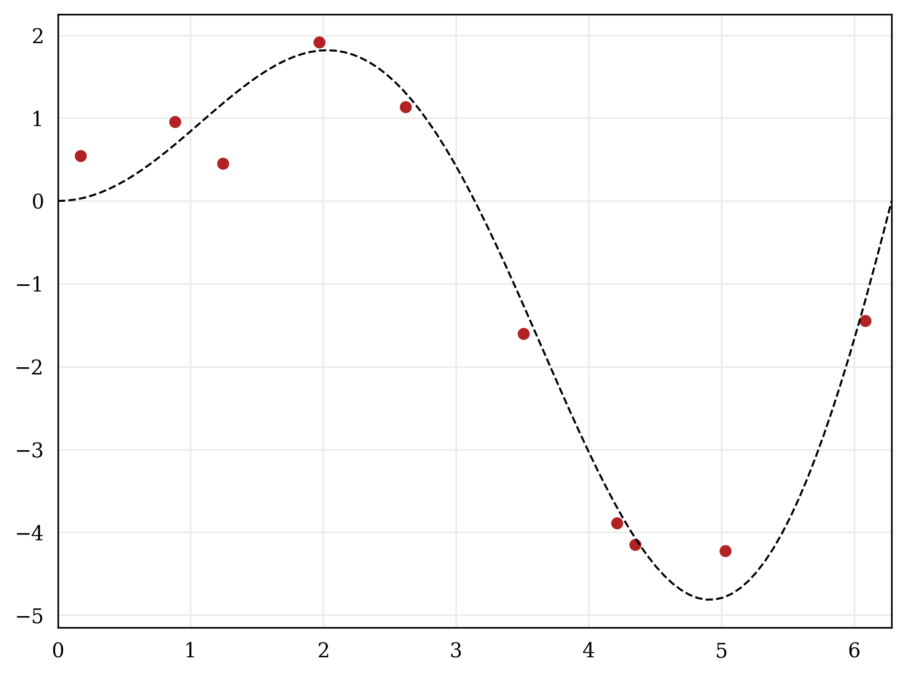
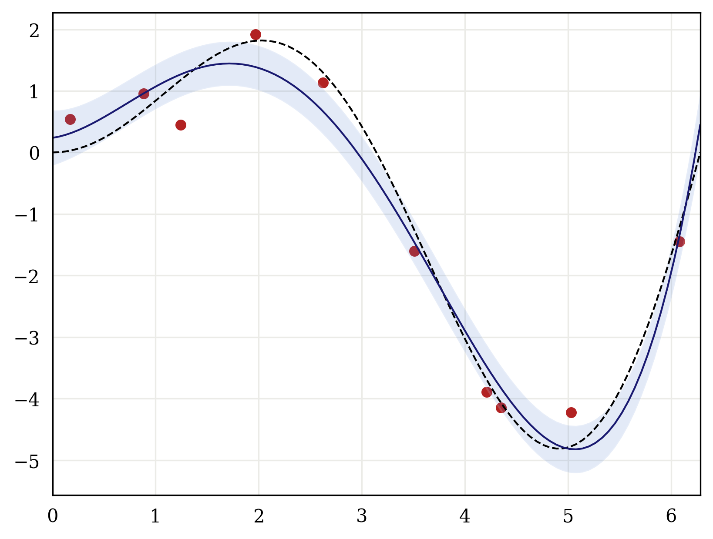
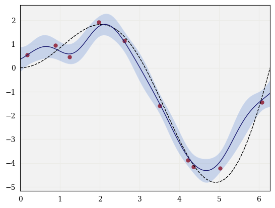
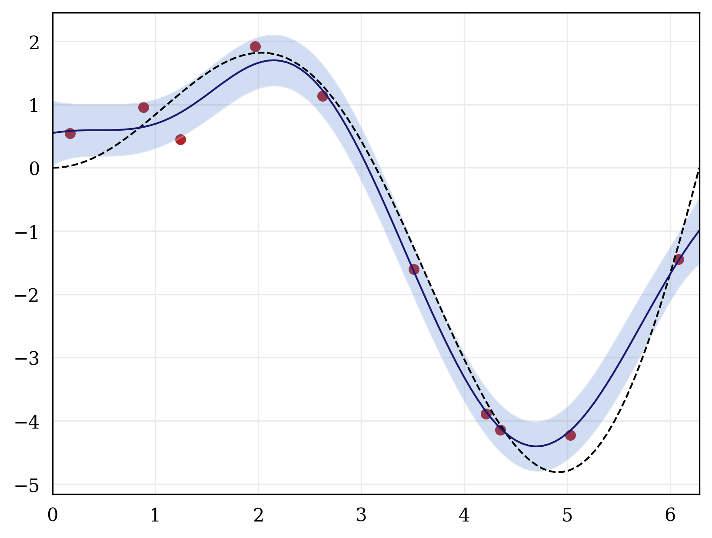

<!-- TO DO:
* proper way to format footnote headers
* ctrl + f: we -> I, when applicable
* change \mid to \Big| where appropriate
* am I using \phi instead of \bphi in some places?
* clean up figures: axes, titles, legends, etc.
* consistent format for references (e.g., Bishop, 2006, Bishop (2006), or [Bishop 2006])
* at the end, discuss varying hyperparameters and how to make optimizations with Cholesky factorization
* type hinting for `kernel`; e.g., from typing import Callable?
* double check formulas in `ZeroMeanGP` class -> when to use K vs. K + sigma^2I
* when to use \btheta vs. \theta
-->

Gaussian processes (GPs) have always been a particularly confounding topic for me in machine learning. In this blog, I attempt to present a spelled-out introduction to GPs, building up from a simple linear model. I provide both the underlying mathematics as well as a Python implementation. For the sake of clarity, I omit certain practical considerations regarding numerical stability, computational complexity, etc., which can all be found in standard treatments of GPs.


## Bayesian linear regression

### The linear model

To build the foundation for GPs, I'll start by considering a Bayesian treatment of linear regression. We'll see that this is in fact a basic example of a GP.

Consider the linear model

$$
\begin{align*}
f(\x; \w) = \x\T\w,
\end{align*}
$$

where $\x \in \R^d$ is some input vector with $d$ features and $\w \in \R^d$ is the vector of parameters which specify the model. Note that we can incorporate an intercept term by always letting one element of $\x$ be constant, say $x_0 = 1$: [^fn1]

$$
f(\x; \w) = w_0 + w_1x_1 + \cdots + w_{d-1}x_{d-1}.
$$

Moreover, we can define a feature transformation $\phi: \R^d \to \R^m$. This transforms our feature vectors as follows:

$$
\phi(\x) = 
\begin{bmatrix}
\phi_0(\x) \\\\
\phi_1(\x) \\\\
\vdots \\\\
\phi_{m-1}(\x)
\end{bmatrix}.
$$

Again, letting $\phi_0(\x) = 1$ implicitly defines a bias term. Now, we can redefine our model in terms of these basis functions:

$$
f(\x; \w) = \bphi\T\w,
$$

where $\bphi = \phi(\x)$, and I've abused notation by now letting $\w \in \R^m$. If the basis functions $\{\phi_i\}$ are nonlinear in terms of $\x$, we can model nonlinear relatiomships while still enjoying the benefits of a linear model, since $f$ is linear in terms of the learned parameters $\w$.

For example, suppose we have a one-dimensional input $x$, and we wish to model the class of polynomials up to degree $m-1$. Then, we simply define $\phi_j(x) = x^j$, which gives the following model:

$$
\begin{align*}
f(\x; \w) &= \bphi\T\w \\\\
&= w_0\phi_0(x) + w_1\phi_1(x) + \dots + w_{m-1}\phi_{m-1}(x) \\\\
&= w_0 + w_1x + w_2x^2 + \dots + w_{m-1}x^{m-1}
\end{align*}
$$

Now, we usually assume that a given observation $(\x, y)$ is corrupted by some noise, which we can model by adding a zero-mean Gaussian random variable to the functional outputs:

$$
y = f(\x; \w) + \epsilon,
$$

where $\epsilon \sim \Norm(0, \sigma^2)$. This gives rise to a probability distribution over $y$: [^fn2]

$$
\begin{align*}
p(y \mid \x, \w, \sigma^2) = \Norm(y \mid f(\x; \w), \sigma^2).
\end{align*}
$$

Before moving forward, I'll make a quick note on notation: when referring to a general probability distribution $p$, we list the unobserved variables on the LHS of the conditional and the observed variables on the RHS, including hyperparameters like $\sigma^2$, in no particular order. For example, $p(y \mid \x, \w, \sigma^2) = p(y \mid \w, \sigma^2, \x)$. It's completely arbitrary what order the variables are in, so long as they fall on the correct side of the conditional, and often certain variables are omitted from the notation and implicitly assumed. From this point, I will omit hyperparameters from the general expressions for distributions. However, when we refer to a specific distribution like the Gaussian, the positions of given variables follow certain conventions: the first position after the conditional is reserved for the mean, and the second position is reserved for the variance, hence I'll write $p(y \mid \x, \w) = \Norm(y \mid f(\x; \w), \sigma^2)$.

### Computing the parameters

Now, suppose we observe some iid dataset $\cD = (\X, \y)$, where $\X \in \R^{d\times n}$ is the matrix whose columns are the $n$ observed input vectors, and $\y = (y_1, y_2 ,\ldots, y_n)\T$ contains the correspondng target variables. Moreover, we can write the matrix containing our feature vectors as $\bPhi \in \R^{m\times n}$. Then, we have the following matrix equation:

$$
\y = \bPhi\T\w + \bepsilon,
$$

where $\bepsilon \sim \Norm(\zv, \sigma^2\I)$. As is often the case in supervised learning, we seek to find reasonable values for the parameters $\w$ in light of this observed data. In the frequentist approach to linear regression, we might model the likelihood function:

$$
\begin{align*}
p(\cD \mid \w) &= p(\y \mid \X, \w) \\\\
&= p(y_1, \dots, y_n \mid \x_1, \dots, \x_n, \w) \\\\
\text{\scriptsize (from iid assumption)} \qquad &= \prod_{i=1}^n p(y_i \mid \x_i, \w) \\\\
&= \prod_{i=1}^n \Norm(y_i \mid f(\x_i; \w), \sigma^2).
\end{align*}
$$

Then, we would maximize this expression with respect to $\w$, which would give a point estimate for the parameters.

Instead, we will take a Bayesian treatment, which will allow us to compute a probability distribution over all possible values of of the parameters. To do so, we start by defining a prior on $\w$:

$$
p(\w) = \Norm \left( \w \mid \zv, \bSigma \right).
$$

With no previous information about $\w$, it's reasonable to assume that all values of $\w$ are equally likely --- this corresponds to a zero-mean Gaussian. Furthermore, we often assume the elements of $\w$ are independent, so $\bSigma = \alpha\I$, for some constant $\alpha$. However, I'll continue with the general form for the prior covariance.

Now, we'd like to infer the values of $\w$ from the observed data by computing the posterior distribution $p(\w \mid \cD)$. To do so, we can model the joint distribution of $\y$ and $\w$, then use the [rules for conditioning](../gaussian/#conditioning) on multivariate Guassian distributions.[^fn3] First, we note that $\y$ is the [sum of two Gaussians](../gaussian/#sum-of-gaussians); the transformed $\bPhi\T\w$, and $\bepsilon$. Thus, $\y$ will be Gaussian-distributed as follows:

$$
p(\y \mid \X) = \Norm \left( \y \bmid \zv, \bPhi\T\bSigma\bPhi + \sigma^2\I \right).
$$

Then, we compute the covariance between $\y$ and $\w$:

$$
\cov(\y, \w) = \cov(\bPhi\T\w + \bepsilon, \w) = \bPhi\T\cov(\w, \w) = \bPhi\T\bSigma.
$$

The joint distribution is then given by

$$
p(\y, \w \mid \X) = \Norm \left( \left. \begin{bmatrix}
\y \\\\
\w
\end{bmatrix}\right\vert
\zv, \begin{bmatrix}
\bPhi\T\bSigma\bPhi + \sigma^2\I & \bPhi\T\bSigma \\\\
\bSigma\bPhi & \bSigma
\end{bmatrix}
\right).
$$

Now we can compute the conditional distribution $p(\w \mid \y, \X),$ which is Gaussian with the following parameters:

$$
\begin{align*}
\bmu_{\w\mid\cD} &= \bSigma\bPhi \left( \bPhi\T\bSigma\bPhi + \sigma^2\I \right)\inv\y, \\\\
\bSigma_{\w\mid\cD} &= \bSigma - \bSigma\bPhi\left( \bPhi\T\bSigma\bPhi + \sigma^2\I \right)\inv \bPhi\T\bSigma.
\end{align*}
$$


### Making predictions

Using our posterior parameter distribution $p(\w \mid \cD)$, we'd like to now make predictions at new test points $\X_\ast$, i.e., we'd like to compute the posterior predictive distribution $p(\y_\ast \mid \X_\ast, \cD)$. One way to do this is to average over all values of $\w$:

$$
p(\y_\ast \mid \X_\ast, \cD) = \int p(\y_\ast \mid \X_\ast, \w) p(\w \mid \cD) d\w,
$$

where $p(\y_\ast \mid \X_\ast, \w)$ is the likelihood of the new test points. This integral is tractable, but takes a bit of work.[^fn4] An easier way to compute the predictive distribution is to note that, under our model,

$$
\y_\ast = \bPhi_\ast\T\w + \bepsilon.
$$

Then, if we use the posterior distribution over $\w$ and once again use the rules for transforming Gaussians, we have the following result:

$$
p(\y_\ast \mid \X_\ast, \cD) = \Norm \left( \y_\ast \Big| \bPhi_\ast\T\bmu_{\w\mid\cD}, \bPhi_\ast\T\bSigma_{\w\mid\cD}\bPhi_\ast + \sigma^2\I \right).
$$


### Bayesian linear regression in Python

Here I show a simple implementation of Bayesian linear regression in Python.

First, I'll construct a toy dataset:

```py
import numpy as np
from math import pi

f = lambda x: x * np.sin(x)

xs = np.linspace(0, 2*pi, 100)
ys = f(xs)
```

This generates 100 evenly-spaced points on the interval $[0, 2\pi]$, as well as the corresponding functional outputs according to the function $f(x) = x\sin(x)$. To construct a training set, we can uniformly sample points in the domain and evaluate their corresponding functional values:

```py
np.random.seed(1)

n_samples = 10

# Noise term with variance 0.1 - note that Var(bX) = b^2 * Var(X)
epsilon = np.sqrt(0.1) * np.random.standard_normal(size=n_samples)

X_data = np.random.uniform(0, 2*pi, size=n_samples)
y_data = f(X_data) + epsilon
```

I've also added a noise term `epsilon` with variance 0.1 to the observations. This gives a dataset of noisy observations $\cD = (\X, \y)$ as we saw before, and our goal is to approximate the function $f$ on the entire domain. Before going further, it's always a good idea to visualize the data (if applicable) for any machine learning task:

```py
import matplotlib.pyplot as plt
import seaborn as sns

# Set up Seaborn plotting style - this can be ignored
sns.set_style("darkgrid",
              {"axes.facecolor": ".95",
               "axes.edgecolor": "#000000",
               "grid.color": "#EBEBE7",
               "font.family": "serif",
               "axes.labelcolor": "#000000",
               "xtick.color": "#000000",
               "ytick.color": "#000000",
               "grid.alpha": 0.4 })
sns.set_palette('muted')

def create_base_plot():
    fig, ax = plt.subplots()
    ax.plot(xs, ys, c='k', ls='dashed', lw=1, label=r'$f(x) = x\sin(x)$')
    ax.scatter(X_data, y_data, c='firebrick', s=25, label='Training samples')
    ax.set_xlim(0, 2*pi)
    return ax

create_base_plot()
```

<div id="fig1" class="figure">
   
</div>

Now, we can build our model. First, we define a feature map $\phi:\R \to \R^m$ as in the first section, where

$$
\phi(x) = w_0 + w_1x + \cdots + w_{m-1}x^{m-1}.
$$

We can implement this as follows:

```py
def poly_feature_transform(X: np.ndarray, m: int) -> np.ndarray:
    """
    Transform the input vectors X into polynomial features of degree m.
    
    Args:
    X: np.ndarray
        The input of shape (n, 1); n is number of samples
    m: int
        The degree of the polynomial features.
    
    Returns:
    X_poly : np.ndarray
        The transformed feature vector with polynomial features of shape
        (m, n)
    """
    n = X.shape[0]
    X_poly = np.ones(n).reshape(n, 1)  # Instantiate X_poly with intercept terms

    for i in range(1, m):
        # Add column of features x^i
        X_poly = np.concatenate((X_poly, X.reshape(n, 1)**i), axis=1)
    
    return X_poly.T   # (m, n)
```

Next, we'd like to compute the posterior parameter and predictive distributions, and make predictions at new test points:

```py
def make_predictions(
    X: np.ndarray, X_star: np.ndarray, y: np.ndarray, sigma: float = 0.1
):
    """
    Compute posterior paramter distribution and make predictions at test points.

    Args:
    X: np.ndarray
        Input of shape (m, n); m is dimension of feature space, n is number
        of samples
    X_star: np.ndarray
        Test points of shape (m, n_star) at which to make new predictions;
        n_star is number of test points
    y: np.ndarray
        Training labels of shape (n,)
    sigma: float (default = 0.1)
        Noise variance

    Returns:
    mean: np.ndarray
        Mean of predictive distribution at points X_star; shape = (n_star,)
    std: np.ndarray
        Standard deviation of predictive distribution at points X_star;
        shape = (n_star,)
    """

    m, n = X.shape
    n_star = X_star.shape[1]

    assert X_star.shape[0] == m
    assert y.shape == (n,)

    # Prior covariance of parameter distribution p(w); mean is zero
    S = np.eye(m)   # (m, m)

    # Compute mean and covariance of posterior parameter distribution p(w|D)
    S_post = S - S @ X @ np.linalg.inv(X.T @ S @ X + sigma*np.eye(n)) @ X.T @ S
    m_post = S @ X @ np.linalg.inv(X.T @ S @ X + sigma*np.eye(n)) @ y

    assert S_post.shape == (m, m)
    assert m_post.shape == (m,)

    # Compute mean and standard deviation at locations X_star
    mean = X_star.T @ m_post
    std = np.sqrt(np.diag(X_star.T @ S_post @ X_star + sigma*np.eye(n_star)))

    assert mean.shape == std.shape == (n_star,)

    return mean, std
```

The expressions for computing the distributions of interest are just those derived in the previous sections. Using these functions, we can now perform Bayesian linear regression:

```py
m = 4  # Degree of polynomials in feature space is m - 1

X_poly = poly_feature_transform(X_data, m)

X_star = xs  # Predict values of each point in domain
X_star_poly = poly_feature_transform(X_star, m)

mean, std = make_predictions(X_poly, X_star_poly, y_data, sigma=.1)
```

We can now visualize the results:

```py
def plot_predictions(mean, std):
    ax = create_base_plot()
    ax.plot(xs, mean, c='midnightblue', lw=1, label='Model predictions')  
    ax.fill_between(xs, mean-std, mean+std, alpha=.25, label='1 std')

plot_predictions(mean, std)
```

<div id="fig1" class="figure">
   
</div>

The model predictions are shown in blue, with a shaded area corresponding to one standard deviation about the mean.

I would encourage the reader to vary the complexity of the model by using different values of $m$. Some extreme examples would be $m = 1$ or $2$, which would give constant or linear predictions, respectively. Alternatively, by setting the value of $m$ to be very high, we see that the model overfits the data. This is a nice example of the bias-variance tradeoff.


## The kernel trick

If we write out the mean and covariance for the posterior predictive distribution, we have

$$
\begin{align*}
\bmu_{\y_\ast \mid \cD} &= \bPhi_\ast\T\bmu_{\w\mid\cD} \\\\
&= \bPhi_\ast\T\bSigma\bPhi \left( \bPhi\T\bSigma\bPhi + \sigma^2\I \right)\inv\y,
\end{align*}
$$

and

$$
\begin{align*}
\bSigma_{\y_\ast \mid \cD} &= \bPhi_\ast\T\bSigma_{\w\mid\cD}\bPhi_\ast + \sigma^2\I \\\\
&= \bPhi_\ast\T \left[ \bSigma - \bSigma\bPhi \left( \bPhi\T\bSigma\bPhi + \sigma^2\I \right)\inv \bPhi\T\bSigma \right] \bPhi_\ast + \sigma^2\I \\\\
&= \bPhi_\ast\T\bSigma\bPhi_\ast - \bPhi_\ast\T\bSigma\bPhi \left( \bPhi\T\bSigma\bPhi + \sigma^2\I \right)\inv \bPhi\T\bSigma\bPhi_\ast + \sigma^2\I.
\end{align*}
$$

By doing so, we see that all the dependence of the posterior predictive distribution on the features $\bPhi$ and $\bPhi_\ast$ is in the form of one of the following expressions:

$$
\begin{gather}\label{1}
\bPhi\T\bSigma\bPhi, \quad \bPhi\T\bSigma\bPhi_\ast, \quad \bPhi_\ast\T\bSigma\bPhi, \quad \bPhi_\ast\T\bSigma\bPhi_\ast.
\end{gather}
$$

We can rewrite these quantities as the following matrices:

$$
\begin{align}\label{2}
\K &= \bPhi\T\bSigma\bPhi, \quad \K_\ast = \bPhi\T\bSigma\bPhi_\ast, \quad \K_{\ast\ast} = \bPhi_\ast\T\bSigma\bPhi_\ast.
\end{align}
$$

Note that $\K_\ast = (\bPhi_\ast\T\bSigma\bPhi)\T\\!,\\,$ so we can represent each of the four quantities in $\eqref{1}$ using the three matrices above. Each element of these matrices can be written in the form

$$
k(\x, \x\p) = \phi(\x)\T\bSigma\phi(\x\p),
$$

where I've defined a *kernel function* $k$, also sometimes called a *covariance function*. By noting that $\bSigma$ is positive definite, and hence has a matrix square root,[^fn5] we can rewrite $k$ as
$$
k(\x, \x\p) = \psi(\x)\T\psi(\x\p),
$$
where $\psi(\x) = \Sigma^{1/2}\phi(\x)$. Thus, $k$ corresponds to a valid inner product between two vectors which are functions of the observations. Then, since $k$ corresponds to an inner product between two vectors, the matrices in $\eqref{2}$ are *Gram matrices*.[^fn6] The Gram matrices can then be written in terms of the kernel function:

$$
\begin{equation}\label{3}
\K = k(\X, \X), \quad \K_\ast = k(\X, \X_\ast), \quad \K_{\ast\ast} = k(\X_\ast, \X_\ast).
\end{equation}
$$

We can also rewrite the parameters of the predictive distribution:

$$
\begin{align}
\bmu_{\y_\ast \mid \cD} &= \K_\ast\T \left( \K + \sigma^2\I \right)\inv\y, \label{4} \\\\
\bSigma_{\y_\ast \mid \cD} &= \K_{\ast\ast} - \K_\ast\T \left( \K + \sigma^2\I \right)\inv \K_\ast + \sigma^2\I. \label{5}
\end{align}
$$

Thus, we've shown that for *any* choice of prior covariance $\bSigma$ and feature map $\phi$, we can express our result in terms of a function $k$ which corresponds to some inner product. If we treat this function as a "black box", we could skip the step of explicitly defining these quantities, and simply specify a kernel function to build our Gram matrices. So long as the kernel function we choose can be expressed in terms of a valid inner product, this corresponds to some feature map of the input vectors. I'll shortly discuss how to choose valid kernel functions.


The advantage of this approach is that the feature vectors we'd like to work with might be very high dimensional, and it might be cheaper to work in terms of the kernel function.

As a concrete example,[^fn7] consider some vector $\x = (x_1, x_2, \dots, x_d) \in R^d$, and suppose we wish to express all the monomials up to degree $2$ in terms of the features of $\x$:

$$
\phi(\x) = \begin{bmatrix}
1 \\\\
x_1 \\\\
\vdots \\\\
x_d \\\\[3pt]
x_1^2 \\\\
x_1x_2 \\\\
\vdots \\\\[3pt]
x_d^2
\end{bmatrix}.
$$

Noting that there is one constant term, $d$ linear terms, and $d\choose{2}$ quadratic terms, computing this requires $\mathcal{O}(d^2)$ operations:

$$
1 + d + {d\choose{2}} \sim \mathcal{O}(d^2).
$$

For large $d$, this could become prohibitive to compute. Alternatively, we can write the inner product as

$$
\begin{align*}
\phi(\x)\T\phi(\x\p) &= 1 + \sum_{i=1}^dx_ix_i\p + \sum_{i=1}^dx_i^2x_i^{\prime\\,2} + 2 \sum_{i=1}^d \sum_{i < j} x_ix_j x_i\p x_j\p \\\\
&= 1 + \sum_{i=1}^d x_ix_i\p + \left( \sum_{i=1}^d x_ix_i\p \right)^2 \\\\
&= 1 + \x\T\x\p + (\x\T\x\p)^2.
\end{align*}
$$

Thus, we can define the kernel function $k(\x, \x\p) = 1 + \x\T\x\p + (\x\T\x\p)^2$. In doing so, we can just plug $\x$ into the kernel function and make our predictions based on these values using the expressions for the parameters defined by $\eqref{4}$ and $\eqref{5}$. We never have to compute the explicit feature map $\phi(\x)$, nor the parameters $\w$.


### Comments on valid kernel functions

A caveat to the approach described above is that we must use a *valid* kernel function, i.e., a kernel which corresponds to an inner product. Luckily, there are some fairly straightforward methods of obtaining these.

There are several ways to check if a function is a valid kernel; one way is to show that, for any set of vectors $S$, the Gram matrix whose elements are given by $\K_{ij} = k(\x_i, \x_j)$ for each $\x_i, \x_j \in S$ is always positive-semidefinite. Another way is to show that $k$ can be represented as $k(\x, \x\p) = \psi(\x)\T\psi(\x\p)$, for some explicit feature map $\psi$, as we saw before.

Moreover, once we have some valid kernel functions, we can use these as building blocks to construct new ones. For example, sums and products of valid kernels yield still valid kernels, along with many other transformations. We can take advantage of these properties to build rich classes of kernel functions.

There are many great resources on covariance functions (namely [Rasmussen & Williams (2006)](#references)), so I won't go into much detail here; however, I'll introduce a common kernel which we'll use, known as the *squared exponential*: [^fn8]

$$
k(\x, \x\p) = a^2 \exp \left( -\frac{\left\lVert \x - \x\p \right\rVert^2}{2l^2}\right).
$$

Here, $a$ is known as the amplitude and acts as a scaling factor. The parameter $l$ is known as the lengthscale and controls the contribution to the covariance from points $\x\p \neq \x$.


## Gaussian process regression

Let's now return to the context of Bayesian linear regression. We have the following expression for the the predictive distribution: 

$$
p(\y_\ast \mid \X_\ast, \cD) = \Norm\left( \y_\ast \bmid \bmu_{\y_\ast\mid\cD}, \bSigma_{\y_\ast\mid\cD} \right),
$$

for which the parameters are given by $\eqref{4}$ and $\eqref{5}$.

We previously derived these results by performing inference over the parameters. However, instead of reasoning about $\w$ and $\bphi$, we showed that we can represent the quantities of interest - that is, the parameters of the predictive distribution - solely in terms of a kernel function and given quantities. Then, instead of performing inference in parameter space, we can express the mean and covariance as functions, and our job becomes that of performing inference directly in the space of functions.

This gives rise to the GP framework. We write a GP as

$$
f \sim \GP(f; m, k),
$$

where $f$ is the function that is "sampled" from the GP. Like the Gaussian distribution, a GP is entirely specified by its first and second moments:

$$
\begin{align*}
m(\x) &= \E[f(\x)], \\\\
k(\x, \x\p) &= \E[(f(\x) - m(\x))(f(\x\p) - m(\x\p))].
\end{align*}
$$

However, instead of explicitly constructing $k$, we just define some kernel function as discussed in the previous section.

In the following sections I will develop the technology necessary to perform GP regression, which should also illuminate precisely how we model functions with a GP; however, before I do so, I will attempt to provide some intuition. First, I'll state the formal definition of a GP:

**Definition.** &nbsp; *A Gaussian Process (GP) is a collection of random variables such that any finite collection of which takes a joint multivariate Gaussian distribution.*

To see this, consider the case in which we define the function $f$ over a continuous interval $[a, b]$, and we'd like to model the relationship between functional outputs $f(\x)$ for each $\x \in [a, b]$. Since this set contains uncountably many variables, we can't use our usual definition for the multivariate Gaussian distribution.  However, this definition states that if we take a finite subset of this interval, say $\\{\x_1, \ldots, \x_n\\} \subseteq [a, b]$, then the random variables $\\{f(\x_1), \ldots, f(\x_n)\\}$ will be jointly Gaussian-distributed. The GP specifies how we compute the parameters of this distribution. [^fn9]

This gives rise to one interpretation of GPs: where functions are the infinite-dimensional extension of fininite-dimensional vectors, GPs can be seen as an infinite-dimensional extension of the multivariate Gaussian distribution.


### Exact observations

Analagously to Bayesian linear regression, we start with a *prior process* over the function $f$. Then, we will use observed data to reason about the distribution over functions.

First, suppose we can observe the functional outputs directly, i.e., with no noise, so that our dataset is $\cD = (\X, \f)$, where $\f = (f(\x_1), \ldots, f(\x_n))\T$. Note that $f$ denotes the actual function we aim to model, and $\f$ denotes the vector of observations of the function.

As before, we'd like to predict the functional values $\f_\ast$ at new points $\X_\ast \in \R^{d\times n_\ast}$. Note that $\f$ and $\f_\ast$ are finite subsets of the function $f$ over the domain of interest. Thus, from our definition of a GP, the joint distribution $p(\f, \f_\ast)$ will be multivariate Gaussian with mean and covariance defined by the corresponding functions. Letting the prior mean $m(\x) = 0$, we can model the joint distribution as

$$
\begin{bmatrix}
\f \\\\
\f_\ast
\end{bmatrix} \sim
\Norm \left(
\zv, \begin{bmatrix}
\\;\K\\;\\; & \K_\ast \\\\
\\;\K_\ast\T & \K_{\ast\ast}
\end{bmatrix}
\right),
$$

where the components of the covariance matrix are given by $\eqref{3}$. As before, we condition $\f_\ast$ on $\f$ to acquire the posterior distribution over the test points:

$$
p(\f_\ast \mid \X_\ast, \cD) = \Norm\left( \f_\ast \bmid \bmu_{f\mid\cD}(\X_\ast), \K_{f\mid\D}(\X_\ast, \X_\ast) \right).
$$

The parameters are given by our usual conditioning formulas:

$$
\begin{align*}
\bmu_{f\mid\cD} &= \K_\ast\T\K\inv\f, \\\\
\K_{f\mid\cD} &= \K_{\ast\ast} - \K_\ast\T\K\inv\K_\ast.
\end{align*}
$$

### Noisy observations

We can extend this to the case of noisy observations, i.e., the case in which we cannot observe values of $f$ directly, but some $y$ corrupted by Gaussian noise:

$$
y = f(\x) + \epsilon.
$$

This gives rise to the following distribution over obserations:

$$
\y \sim \Norm(\zv, \K + \sigma^2\I).
$$

As before, we'd like to predict the values of test points $\f_\ast$. The joint distribution now takes the form

$$
\begin{bmatrix}
\y \\\\
\f_\ast
\end{bmatrix} \sim
\Norm \left( \zv, \begin{bmatrix}
\K + \sigma^2\I & \K_\ast \\\\
\K_\ast\T & \K_{\ast\ast}
\end{bmatrix} \right).
$$

Using the same conditioning rules as before, the parameters of our predictive distribution $p(\f_\ast \mid \X_\ast, \cD)$ are given by

$$
\begin{align*}
\bmu_{f\mid\cD} &= \K_\ast\T \left( \K + \sigma^2\I \right)\inv\y \\\\
\K_{f\mid\cD} &= \K_{\ast\ast} - \K_\ast\T \left( \K + \sigma^2\I \right)\inv \K_\ast.
\end{align*}
$$

To compute the predictive distribution for $\y_\ast$, we simply add $\epsilon$ to the predicted outputs $\f_\ast$:

$$
p(\y_\ast \mid \X_\ast, \cD) = \Norm \left( \y_\ast \bmid \bmu_{f\mid\cD}, \K_{f\mid\cD} + \sigma^2\I \right).
$$


### Gaussian process regression in Python

We now have all the tools to build a GP regression model from scratch:

```py
class ZeroMeanGP:
    """Gaussian process model with zero mean."""
    def __init__(
        self, X_train: np.ndarray, y_train: np.ndarray, kernel, sigma: float = 0.1
    ):
        """
        Initialize GP model.

        Args:
        X_train: np.ndarray
            Training data of shape (d, n); d is dimension of feature space,
            n is number of samples
        y_train: np.ndarray
            Training labels of shape (n,)
        kernel:
            Kernel function; takes two vectors as input and returns a scalar
        sigma: Noise variance
        """
        self.kernel = kernel
        self.sigma = sigma
        self.set_training_data(X_train, y_train)
    
    def set_training_data(self, X_train: np.ndarray, y_train: np.ndarray):
        """Initialize training data."""
        self._X_train = X_train
        self._y_train = y_train
        self._K_train_train = self.make_covar(X_train, X_train) + self.sigma * np.eye(len(X_train))

    def make_covar(self, X1, X2):
        """Build covariance matrix from kernel function."""
        covar = np.zeros(shape=(X1.shape[0], X2.shape[0]))

        # Compute pairwise kernel values
        for i, xi in enumerate(X1):
            for j, xj in enumerate(X2):
                covar[i, j] = self.kernel(xi, xj)
        return covar

    def predict(self, X_test: np.ndarray, full_covar: bool = False):
        """
        Make predictions at new test points.

        Args:
        X_test: np.ndarray
            Test points of shape (d, n_star); n_star is number of test samples
        full_covar: bool (default = False)
            Indicates whether to return full covariance matrix or just diagonal elements
        
        Returns:
        mean: np.ndarray
            Mean of predicted function values at points X_test; shape = (n_star,)
        cov: np.ndarray
            Covariance of predicted function values; if full_covar,
            returns matrix of shape (n_star, n_star), else shape = (n_star,)
        """
        K_train_test = self.make_covar(self._X_train, X_test)
        K_test_test = self.make_covar(X_test, X_test)

        # Pre-compute inverse of covariance for repeated use
        K_inv = np.linalg.inv(self._K_train_train)

        # Posterior mean
        mean = K_train_test.T @ K_inv @ self._y_train

        # Posterior covariance
        cov = K_test_test - K_train_test.T @ K_inv @ K_train_test + self.sigma * np.eye(len(X_test))

        if full_covar:
            return mean, cov
        else:
            return mean, np.diag(cov)
```

Our GP class takes training data and a kernel function as input, and computes $\K$ by evaluating the pairwise kernel values. Note that we assumed the prior mean is zero. We also have the option to specify the noise variance $\sigma$. We can handle the case of exact observations by setting this equal to zero. Then, we compute the posterior predictions using the formulas derived in the previous section. The variables `K_train_test` and `K_test_test` correspond to $\K_\ast$ and $\K_{\ast\ast}$, respectively.

We can now make predictions with our model and visualize the results as follows:

```py
def squared_exponential(x, x_prime, amp=1, length=.5):
    return amp**2 * np.exp(- (x - x_prime)**2 / (2 * length**2))

gp = ZeroMeanGP(X_data, y_data, squared_exponential)
mean, cov = gp.predict(X_star)
std = np.sqrt(cov)

plot_predictions(mean, std, save=True)
```

<div id="fig3" class="figure">
   
</div>


### Varying the hyperparameters

The performance of the GP can depend drastically on the setting of the hyperparameters. In this case, our hyperparameters are the amplitude and noise of the squared exponential function, as well as the noise variance $\sigma^2$.

For simple problems like ours, we can often choose appropriate hyperparameter settings by inspecting a few reasonable options. There are also common methods for choosing reasonable values.[^fn10] However, for more sophisticated problems, particularly those in high-dimensional spaces, we might like to employ more robust methods for finding reasonable values for the hyperparameters.

We can assess how well the model fits the training data by computing the marginal likelihood, defined as

$$
p(\y \mid \X, \theta) = \Norm \big( \y \mid \bmu(\X; \theta), \K(\X, \X; \btheta) \big),
$$

where $\theta$ is some vector containing the hyperparameters. This measures the likelihood of drawing samples from our modeled distribution Thus, choosing some hyperparameters for which the likelihood is high corresponds to choosing a model which closely approximates the true distribution of the data.

In practice, we usually compute the marginal *log*-likelihood (MLL). This takes the form:

$$
\begin{align*}
\log p(\y \mid \X, \btheta) &= - \frac{n}{2} \log 2\pi - \frac{1}{2} \log \Big| \K + \sigma^2\I \Big| \\\\[4pt]
&- \frac{1}{2} \Big( \y - \bmu \Big)\T \Big( \K + \sigma^2\I \Big) \inv \Big( \y - \bmu \Big).
\end{align*}
$$

Note that the first term is constant with respect to the hyperparameters, so we can ignore this when maximizing the MLL. Moreover, we are assuming that the mean function is zero. Thus, we have the following simplified expression for the MLL:

$$
\log p(\y \mid \X, \btheta) \propto - \log \Big| \K + \sigma^2\I \Big| - \y\T \Big( \K + \sigma^2\I \Big) \inv \y.
$$

We can now implement a function in the `ZeroMeanGP` class to compute the MLL:

```py
def compute_mll(self):
        """Compute the MLL of training data."""
        n = len(self._X_train)
        K = self._K_train_train
        K_inv = np.linalg.inv(K)
        mll = - np.log(np.linalg.det(K)) - self._y_train.T @ K_inv @ self._y_train
        return mll
```

Then, we can define the following to optimize the MLL with respect to the hyperparameters:

```py
from scipy.optimize import minimize

def optimize_hyperparams(X_data, y_data, init_params):
    def objective(params):
        amp, length, sigma = params
        kernel = partial(squared_exponential, amp=amp, length=length)
        gp = ZeroMeanGP(X_data, y_data, kernel, sigma=sigma)
        return -gp.compute_mll()  # negative because we minimize
    
    result = minimize(objective, init_params)
    return result.x
```

Finally, let's find the optimal hyperparameters and once more make predictions:

```py
init_params = (2.0, 1.0, 0.1)
optimized_params = optimize_hyperparams(X_data, y_data, init_params)
print(optimized_params.round(3))

[2.308 1.331 0.111]
```

```py
amp, length, sigma = optimized_params
kernel = partial(squared_exponential, amp=amp, length=length)
gp = ZeroMeanGP(X_data, y_data, kernel, sigma=sigma)

mean, cov = gp.predict(X_star)
std = np.sqrt(cov)
plot_predictions(mean, std)
```

<div id="fig4" class="figure">
   
</div>


Thanks for reading!


## References

1. C. M. Bishop, [*Pattern Recognition and Machine Learning*](https://www.microsoft.com/en-us/research/wp-content/uploads/2006/01/Bishop-Pattern-Recognition-and-Machine-Learning-2006.pdf), 2006.

2. C. E. Rasmussen & C. K. I. Williams, [*Gaussian Processes for Machine Learning*](https://gaussianprocess.org/gpml/chapters/RW.pdf), 2006.

3. Henry Chai's course, [*Bayesian Methods in Machine Learning*](https://www.cs.cmu.edu/~hchai2/courses/10624/), 2025.


[^fn1]: For a given variable, I use bold-faced symbols to refer to vectors; e.g., $\x \in \R^d,$ and I use regular symbols to denote scalar values; e.g., the components of $\x$ are $(x_0, x_1, \dots, x_{d-1}).$

[^fn2]: This can be computed by noting that $y = f + \epsilon$ is an [affine transformation](../gaussian/#affine-transformation) of $\epsilon$. In general, given a Gaussian random variable $\x \sim \Norm(\bmu, \bSigma)$, the affine transformation $\y = \A\x + \b$ will also be Gaussian-dsitributed with $\y \sim \Norm(\A\bmu + \b, \A\bSigma\A\T)$.

[^fn3]: Alternatively, we could compute the posterior directly via Bayes' rule:
$$
p(\w \mid \cD) = \frac{p(\cD\mid\w)p(\w)}{p(\cD)}
$$

[^fn4]: This integral can be done explicitly by writing out the integrand as a product of Gaussians, then completing the square in the exponent in terms of $\w$. The integrand takes the form of a Gaussian distribution over $\w$, which can be easily computed by equating it to the reciprocal of its normalization constant, and the resulting predictive distribution takes the form of a Gaussian in terms of the variables which are left over, i.e., those which were factored out of the integral.

[^fn5]: To see this, note that any $n\times n$ positive definite matrix has a valid eigenvalue decomposition. Thus, we can write $\bSigma = \U\Lambda\U\T$, where $\U\U\T = \I$, $\Lambda = \diag(\lambda_1, \dots, \lambda_n)$, and $\{\lambda_i\}$ are the eigenvalues of $\bSigma$ (also note that, since $\bSigma$ is positive definite, its eigenvalues are positive). Then, we define the matrix square root as $\bSigma^{1/2} = \U\Lambda^{1/2}\U\T$, where $\Lambda^{1/2}$ is, perhaps unsurprisingly, the matrix whose diagonal elements are given by the square roots of the eigenvalues.

[^fn6]: A Gram matrix is one whose elements are given by the pairwise inner products of a set of vectors. Thus, the kernel function $k$ corresponds to a valid inner product between the vectors $\psi(\x)$ and $\psi(\x\p)$.

[^fn7]: I got this example from Prof. Henry Chai's [lecture slides](https://www.cs.cmu.edu/~hchai2/courses/10624/lectures/Lecture7_Slides.pdf) on the kernel trick.

[^fn8]: Some (justifiably) prefer the name "exponentiated quadratic".

[^fn9]: Note that, in the case where a GP is defined over finitely many variables, this just reduces to the familiar multivariate Gaussian distribution.

[^fn10]: For example when using the squared exponentional covariance function, it is commong to set the amplitude equal to the variance of the training set and the lengthscale equal to $.01$ times the amplitude. Similarly, it is common to use a constant mean function equal to the average of the training set. Moreover, one might initialize the hyperparameters to these settings, then maximize the MLL with respect to the hyperparameters under gradient descent.