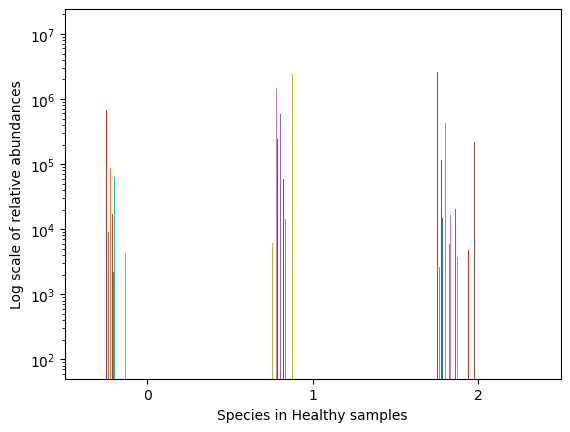
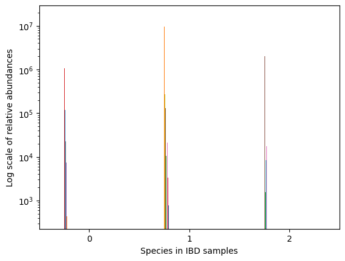
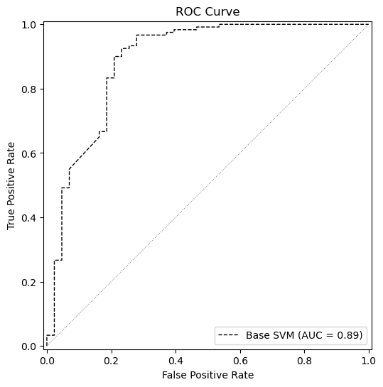
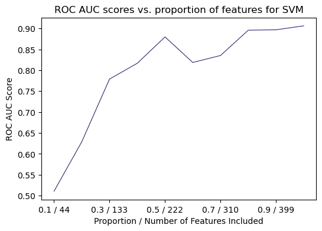
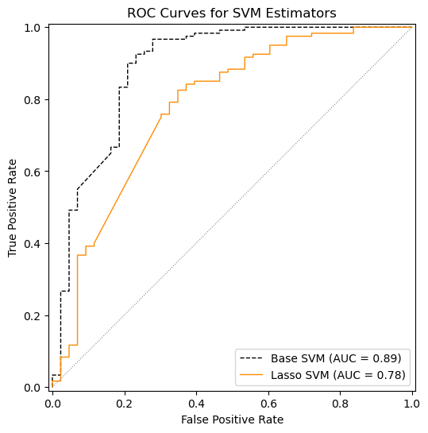
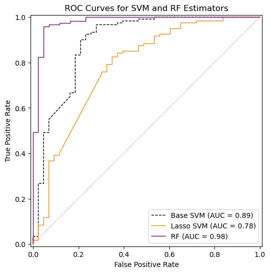
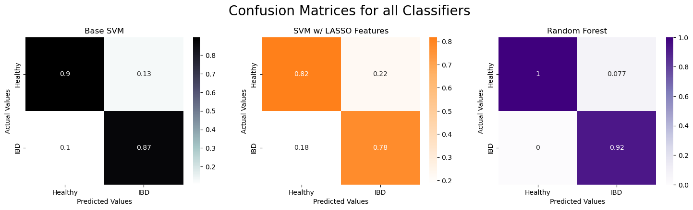
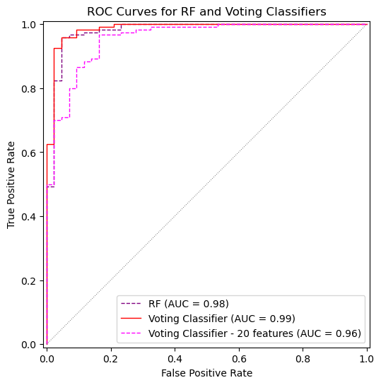

The human microbiome is a data rich ecosystem, which is generally known to have strong associations with host phenotypes (i.e., the set of observable characteristics of an organism). Yet, the extents of these relationships are not yet deeply understood. Until recently, the computing capabilities necessary to thoroughly analyze human microbiome data were severely lacking. However, due to novel advancements in sequencing technologies and data analysis techniques, there now exist a plethora of data, along with robust statistical tools, which can be leveraged to gain valuable insights into the impact of the human microbiome on overall health. Methods which can accurately detect disease early in developmental stages have the potential to revolutionize personalized and preventative medicine.

In this post, I explore state-of-the-art machine learning methods for processing human microbiome data, building upon the work of [Pasolli et al. [2016]](https://journals.plos.org/ploscompbiol/article/file?id=10.1371/journal.pcbi.1004977&type=printable). Using data from the [Integrative Human Microbiome Project (HMP2) [2019]](https://pubmed.ncbi.nlm.nih.gov/31142855/), I demonstrate that IBD can be accurately identified using just 20 species of bacteria found in the human gut - a dramatic reduction from previous approaches requiring 200+ features. My majority-vote classification approach, an ensemble of XGBoost, CatBoost, LightGBM and random forests, achieves an ROC AUC score of 0.945 - a notable improvement from the previous study's 0.890.

## Data Loading and Preprocessing

The data I will be analyzing was taken as part of the [Integrative Human Microbiome Project (HMP2) [2019]](https://pubmed.ncbi.nlm.nih.gov/31142855/), which includes 1627 stool samples from clinical patients. Each patient was classified with IBD or as a control (i.e., healthy) - this is the target variable. The features are the relative species abundances found in each stool sample. This is the proportion of each species recorded in the sample with respect to the others.

I'm accessing data from `curatedMetagenomicData()`, a package within the R Bioconductor library which grants accessed to the dataset curated by [Pasolli et al. [2017]](https://www.biorxiv.org/content/10.1101/103085v2.full.pdf).

First, I'll load the necessary packages and configure some settings:

```py
import numpy as np
import pandas as pd
import matplotlib.pyplot as plt
import seaborn as sns

from sklearn.preprocessing import MinMaxScaler
from sklearn.pipeline import Pipeline
from sklearn.metrics import roc_auc_score, accuracy_score, precision_score, recall_score, f1_score, balanced_accuracy_score, confusion_matrix, RocCurveDisplay
from sklearn.linear_model import LassoCV, ElasticNetCV

from sklearn.svm import SVC
from sklearn.ensemble import RandomForestClassifier, VotingClassifier

from xgboost import XGBClassifier
from lightgbm import LGBMClassifier
from catboost import CatBoostClassifier

import warnings
warnings.filterwarnings("ignore")

np.random.seed(1984)
```

Next, I load the data as a pandas dataframe, explore the structure of the data, and perform some transformations:

```py
ibd = pd.read_csv("data/ibd_rel_abundance.csv")
healthy = pd.read_csv("data/healthy_rel_abundance.csv")

print(ibd.shape())
```

We see that there are 1201 samples with IBD, each with 579 features describing the relative species abundances.

```
ibd.head()
```

<div>
<style scoped>
        .dataframe tbody tr th:only-of-type {
            vertical-align: middle;
        }
</style>
    <table border="1" class="dataframe">
    <thead>
        <tr style="text-align: right;">
        <th></th>
        <th>Phocaeicola vulgatus</th>
        <th>Bacteroides uniformis</th>
        <th>Bacteroides thetaiotaomicron</th>
        <th>Faecalibacterium prausnitzii</th>
        <th>Roseburia faecis</th>
        <th>Bacteroides caccae</th>
        <th>Enterocloster clostridioformis</th>
        <th>Bacteroides fragilis</th>
        <th>Fusicatenibacter saccharivorans</th>
        <th>Flavonifractor plautii</th>
        <th>...</th>
        <th>Prevotella histicola</th>
        <th>Prevotella pallens</th>
        <th>Chlamydia ibidis</th>
        <th>Enterococcus mundtii</th>
        <th>Anaerostipes sp. 992a</th>
        <th>Actinobaculum sp. oral taxon 183</th>
        <th>Lachnoclostridium sp. An298</th>
        <th>Haemophilus haemolyticus</th>
        <th>Enterococcus dispar</th>
        <th>Atopobium minutum</th>
        </tr>
    </thead>
    <tbody>
        <tr>
        <th>0</th>
        <td>8436640</td>
        <td>6235541</td>
        <td>1357098</td>
        <td>1054351</td>
        <td>999360</td>
        <td>551484</td>
        <td>334448</td>
        <td>168192</td>
        <td>139201</td>
        <td>133264</td>
        <td>...</td>
        <td>0</td>
        <td>0</td>
        <td>0</td>
        <td>0</td>
        <td>0</td>
        <td>0</td>
        <td>0</td>
        <td>0</td>
        <td>0</td>
        <td>0</td>
        </tr>
        <tr>
        <th>1</th>
        <td>17080974</td>
        <td>9468596</td>
        <td>2861845</td>
        <td>189087</td>
        <td>190713</td>
        <td>479440</td>
        <td>315591</td>
        <td>182143</td>
        <td>268493</td>
        <td>427323</td>
        <td>...</td>
        <td>0</td>
        <td>0</td>
        <td>0</td>
        <td>0</td>
        <td>0</td>
        <td>0</td>
        <td>0</td>
        <td>0</td>
        <td>0</td>
        <td>0</td>
        </tr>
        <tr>
        <th>2</th>
        <td>12088033</td>
        <td>14919763</td>
        <td>7543241</td>
        <td>452106</td>
        <td>455094</td>
        <td>1991901</td>
        <td>537137</td>
        <td>7969977</td>
        <td>5346</td>
        <td>185637</td>
        <td>...</td>
        <td>0</td>
        <td>0</td>
        <td>0</td>
        <td>0</td>
        <td>0</td>
        <td>0</td>
        <td>0</td>
        <td>0</td>
        <td>0</td>
        <td>0</td>
        </tr>
        <tr>
        <th>3</th>
        <td>9174317</td>
        <td>15253970</td>
        <td>4019070</td>
        <td>988736</td>
        <td>429513</td>
        <td>964149</td>
        <td>46820</td>
        <td>3271311</td>
        <td>37552</td>
        <td>86170</td>
        <td>...</td>
        <td>0</td>
        <td>0</td>
        <td>0</td>
        <td>0</td>
        <td>0</td>
        <td>0</td>
        <td>0</td>
        <td>0</td>
        <td>0</td>
        <td>0</td>
        </tr>
        <tr>
        <th>4</th>
        <td>3662205</td>
        <td>8560295</td>
        <td>7882055</td>
        <td>817546</td>
        <td>814911</td>
        <td>686063</td>
        <td>27640</td>
        <td>4984518</td>
        <td>9446</td>
        <td>411733</td>
        <td>...</td>
        <td>0</td>
        <td>0</td>
        <td>0</td>
        <td>0</td>
        <td>0</td>
        <td>0</td>
        <td>0</td>
        <td>0</td>
        <td>0</td>
        <td>0</td>
        </tr>
    </tbody>
    </table>
</div>

Here we see the first five rows of the pandas dataframe containing the relative species abundances for the IBD samples. We can plot the relative abundances for a few samples to get a sense for the dataset.

```py
# Histogram of the first 3 elements of the healthy dataframe
healthy[:3].plot(kind='bar', legend=False, logy=True, xlabel='Species in Healthy samples', ylabel='Log scale of relative abundances', rot=0);
```

<div id="fig1" class="figure">
  
</div>

```py
# Histogram of the first 3 elements of the IBD dataframe
ibd[:3].plot(kind='bar', legend=False, logy=True, xlabel='Species in IBD samples', ylabel='Log scale of relative abundances', rot=0);
```

<div id="fig2" class="figure">
  
</div>

Immediately, we notice that the healthy samples seem to have higher biodiversity. We can also see that the scale of the entries varies drastically. Of the nonzero features, the scales differ from $\sim 10^3$ to $\sim 10^7$. It's a similar story for the healthy samples. To address this, we will incorporate min-max scaling into our pipeline later.

This is unlabeled data, so we need to insert the target variable:

```py
healthy.insert(0, 'IBD', 0); # 0 for control sample
ibd.insert(0, 'IBD', 1); # 1 for case sample
```

Now, to construct our full dataset, I concatenate the two and shuffle them. I also rename some of the columns to remove characters that will prove problematic later when training our models.

```py
# Concatenate, shuffle, and reindex
data = pd.concat([ibd, healthy]).sample(frac=1).set_index(np.arange(0, 1627))

# Replace brackets in column names
data.columns = data.columns.str.replace('[', '').str.replace(']', '')
```

Finally, I construct the train, validation, and test sets using an 80/10/10 split:

```py
# Create partitions at 80% and 90% of original dataset, resulting in three subsets
train, val, test = np.split(data.sample(frac=1), [int(.8*len(data)), int(.9*len(data))])

X_train = train.drop('IBD', axis=1).fillna(0) # Features
y_train = train['IBD'] # Targets

X_val = val.drop('IBD', axis=1).fillna(0)
y_val = val['IBD']

X_test = test.drop('IBD', axis=1).fillna(0)
y_test = test['IBD']
```

## Feature Selection w/ LASSO and ElasticNet

The resulting dataset is a high-dimensional sparse matrix containing relative species abundances. My goal is to narrow down this set of features to see which are the most important in predicting the target variable. In the long run, this will help us make biological insights into which species are most commonly linked to IBD.

First, I implement a baseline SVM classifier with min-max scaling:

```py
steps = [
    ('scaler', MinMaxScaler()),  # Data preprocessing step
    ('classifier', SVC(C=2048, gamma=.5, kernel='rbf', random_state=1))  # Model step
]

svm_base = Pipeline(steps)

svm_base.fit(X_train, y_train)
```

To evaluate this model, we can visualize the ROC curve:

```py
fig, ax = plt.subplots(figsize=(8, 6))

fig_params = {'estimator' : pipeline,
              'name' : 'Base SVM',
              'X' : X_test,
              'y' : y_test,
              'ax' : ax,
              'c' : 'black',
              'ls' : 'dashed',
              'lw' : 1}

RocCurveDisplay.from_estimator(**fig_params)
ax.plot([0,1], c='gray', ls='dotted', lw=.75)

ax.set_title('ROC Curve')
ax.set_xlabel('False Positive Rate')
ax.set_ylabel('True Positive Rate')

plt.show();
```

<div id="fig3" class="figure">
  
</div>

We see that the base SVM estimator achieves an ROC AUC score of 0.89. Now, I want to perform feature selection on the dataset and see how the model performs on various subsets of the original features. So, I implement two different feature selection methods: Lasso and Elastic Net Regularization. Then, I assess each model's accuracy on different subsets of the features.

First, I implement `LassoCV()`, which searches for the optimal `alpha` parameter in $\\{10^{-4}, 10^{-3.5}, \dots, 10^{.5}\\}$, as described in [Pasolli et al. [2016]](https://journals.plos.org/ploscompbiol/article/file?id=10.1371/journal.pcbi.1004977&type=printable):

```py
alphas = [10**(x) for x in np.arange(-4, 0, step=.5)]

lassoCV = LassoCV(cv = 5,
                  alphas=alphas,
                  random_state=42).fit(X_train, y_train)
```

Similarly, I implement `ENetCV()`, which searches for the optimal `alpha` parameter as before, as well as the optimal `l1_ratio` parameter in $\\{.1, .5, .7, .9, .95, .99, 1\\}$:

```py
l1_ratios = [.1, .5, .7, .9, .95, .99, 1]

enetCV = ElasticNetCV(l1_ratio=l1_ratios,
                      alphas=alphas,
                      cv=5,
                      random_state=1984).fit(X_train, y_train)

enetCV.l1_ratio_
```

```
Output: 1.0
```

Interestingly, ENetCV returned an `l1_ratio` value of 1.0, completely favoring an $L^1$-norm. In this case, ElasticNet is equivalent to LASSO, so I'll only use LASSO hereafter.

Next, I remove all of the columns in which the lasso coefficient is zero:

```py
X_lasso = data.drop(['IBD'], axis=1).copy()
coefs = lassoCV.coef_.copy()

while(int(np.min(np.abs(coefs)) == 0)):
    idx = np.argmin(np.abs(coefs))
    X_lasso = X_lasso.drop(X_lasso.columns[idx], axis=1)
    coefs = np.delete(coefs, idx)

X_lasso.shape
```

```
Output: (1627, 444)
```

I'll also create train, validation, and test splits for this reduced dataset:

```py
X_train_lasso = X_train[X_lasso.columns]
X_val_lasso = X_val[X_lasso.columns]
X_test_lasso = X_test[X_lasso.columns]
```

Now we see that the number of features has been reduced to 444, from the original 579. Moreover, the lasso coefficients now specify relative importances for each feature. I want to further reduce the number features, so I will train and validate the model while varying the percentage of features included in the process, each time selecting the top-$p$ proportion of the features, where $p \in [0, 1]$. This will tell us if a model is still capable of making accurate predictions on even smaller subsets of the features.

In code, this looks like the following:

```py
# Redefine `steps` to incorporate randomness into the model
steps = [
    ('scaler', MinMaxScaler()),  # Data preprocessing step
    ('classifier', SVC(C=2048, gamma=.5, kernel='rbf'))  # Model step
]

percentiles = [.1 * x for x in np.arange(10)]

total_coefs = coefs.size
svm_scores = np.zeros(len(percentiles))

for i, percent in enumerate(percentiles):

    columns = []
    lasso_coefs = coefs.copy()
    d = X_lasso.copy()

    # Contructing the dataset with top p percent of features included:
    for _ in range(int((1-percent) * total_coefs)):
        # Get index of most important feature, append to columns
        idx = np.argmax(np.abs(lasso_coefs))
        columns.append(d.columns[idx])
        # Remove feature from list to search for next most important feature
        lasso_coefs = np.delete(lasso_coefs, idx)
        d.drop(d.columns[idx], axis=1, inplace=True)

    # Construct train and validation sets on new subset of features
    train = X_train_lasso[columns]
    val = X_val_lasso[columns]

    # Training / testing and averaging results:
    for _ in range(20):
        svm = Pipeline(steps)
        svm.fit(train, y_train)
        svm_scores[i] += roc_auc_score(y_val, svm.decision_function(val)) / 20
```

We can also visualize these scores:

```py
fig, ax = plt.subplots(figsize=(6, 4))

ticks = [0.0, 0.2, 0.4, 0.6, 0.8]
labels = ['0.1 / 44', '0.3 / 133', '0.5 / 222', '0.7 / 310', '0.9 / 399']

ax.plot(percentiles[::-1], svm_scores, label='Lasso Features', c='midnightblue', lw=.75)
ax.set_xlabel('Proportion / Number of Features Included')
ax.set_xticks(ticks, labels)
ax.set_ylabel('ROC AUC Score')
ax.set_title('ROC AUC scores vs. proportion of features for SVM');
```

<div id="fig4" class="figure">
  
</div>

We see that with even just 30% of the nonzero LASSO predictors included, the SVM model is able to achieve a decent ROC AUC score - around 0.8. Recall, this 30% corresponds to 133 of the original 579 features - we are slowly whittling down the dimensionality of our dataset.

So, we'll make a reduced dataset with the top 30% of features:

```py
columns = []
lasso_coefs = coefs.copy()
d = X_lasso.copy()

for _ in range(int(.2 * total_coefs)):
    idx = np.argmax(np.abs(lasso_coefs))
    columns.append(d.columns[idx])
    lasso_coefs = np.delete(lasso_coefs, idx)
    d.drop(d.columns[idx], axis=1, inplace=True)

train30 = X_train_lasso[columns]
val30 = X_val_lasso[columns]
test30 = X_test_lasso[columns]
```

Now, I'll train an SVM on this reduced dataset, and see how it performs in comparison to the baseline estimator.

```py
steps = [
    ('scaler', MinMaxScaler()),  # Data preprocessing step
    ('classifier', SVC(C=2048, gamma=.5, kernel='rbf', random_state=1984))  # Model step
]

svm_lasso = Pipeline(steps)
svm_lasso.fit(train30, y_train)

fig, ax = plt.subplots(figsize=(8, 6))

fig_params1 = {'estimator' : svm_base,
              'name' : 'Base SVM',
              'X' : X_val,
              'y' : y_val,
              'ax' : ax,
              'c' : 'black',
              'ls' : 'dashed',
              'lw' : 1}

fig_params2 = {'estimator' : svm_lasso,
              'name' : 'Lasso SVM',
              'X' : val30,
              'y' : y_val,
              'ax' : ax,
              'c' : 'darkorange',
              'ls' : 'solid',
              'lw' : 1}

RocCurveDisplay.from_estimator(**fig_params1)
RocCurveDisplay.from_estimator(**fig_params2)
ax.plot([0,1], c='gray', ls='dotted', lw=.75)

ax.set_title('ROC Curves for SVM Estimators')
ax.set_xlabel('False Positive Rate')
ax.set_ylabel('True Positive Rate')

plt.show();
```

<div id="fig5" class="figure">
  
</div>

As we can see, the SVM trained on this reduced dataset still achieves good predictability - the ROC AUC score fell by approximately 10%, but this is a small decrease considering that we reduced the dimensionality of the feature space from 579 to 133 - almost an 80% decrease.

## Improving the Predictability

Here comes the fun part: let's see how high of a score we can achieve with more sophisticated models. I'll start by constructing a random forest and comparing it's accuracy to the SVM. The process for constructing the RF is outlined in [Pasolli et al. [2016]](https://journals.plos.org/ploscompbiol/article/file?id=10.1371/journal.pcbi.1004977&type=printable), which I reiterate here:

* The parameters are chosen as
  * Number of trees: 500
  * Criterion: Gini impurity
  * Number of features considered at each split: $m = \sqrt{p}$, where $p$ is the total number of predictors

  * `class_weight = balanced`, to account for the imabalance between # of case samples vs. controls (i.e., there are more patients with IBD in the dataset than healthy patients)
* `GridSearchCV()` is performed in an attempt to achieve more optimal parameters; however, no significant improvements were made, so the original parameters were kept 

* An implicit feature selection is performed using the impurity-based feature importance. The steps for this process are:
  1. The RF is trained on the whole dataset
  2. The features were ranked according to the impurity-based importance
  3. The RF is retrained on the top $k$ features, where $k$ is chosen from $\\{5, 10, 20, 30, 40, 50, 60, 70, 80, 90, 100, 125, 150, 175, 200\\}$
  4. The number of features that maximizes the accuracy is chosen
  5. The final model is retrained on this subset of features

I'll start by training the initial RF:

```py
rf = RandomForestClassifier(n_estimators=500,
                           criterion='gini',
                           max_features='sqrt',
                           class_weight='balanced',
                           random_state=1984).fit(X_train, y_train)
```

During the training process for RFs, an implicit feature importance is assigned to each predictor based on the gini impurity. Based on these feature importances, we select the top-$k$ features, selecting a different value for $k$ each time. We re-evaluate an RF on each of these subsets of size $k$, ultimately choosing the value for $k$ which results in the best performance. This is implemented as follows:

```py
feature_importances = rf.feature_importances_

num_features = [5, 10, 20, 30, 40, 50, 60, 70, 80, 90, 100, 125, 150, 175, 200]
rf_scores = []

for k in num_features:
    K_train = X_train.copy()
    K_val = X_val.copy()
    features = feature_importances

    # Constructing list of top k features by dropping lowest 579 - k features:
    for i in range(579 - k):
        idx = np.argmin(features)
        K_train = K_train.drop(K_train.columns[idx], axis=1)
        features = np.delete(features, idx)

    rf_temp = RandomForestClassifier(n_estimators=500,
                                     criterion='gini',
                                     max_features='sqrt',
                                     class_weight='balanced',
                                     random_state=1984).fit(K_train, y_train)
    
    K_val = K_val[K_train.columns]

    rf_scores.append(rf_temp.score(K_val, y_val))

k = num_features[np.argmax(rf_scores)]

print(f"k = {k}")
```

```
Output: k = 200
```

We see that the optimal value for $k$ is 200. So, we'll construct a dataset from the top 200 features, then re-train an RF:

```py
features = feature_importances

K_train = X_train.copy()
K_val = X_val.copy()

for i in range(579 - k):
    idx = np.argmin(features)
    K_train = K_train.drop(K_train.columns[idx], axis=1)
    features = np.delete(features, idx)

K_val = K_val[K_train.columns]

rf = RandomForestClassifier(n_estimators=500,
                            criterion='gini',
                            max_features='sqrt',
                            class_weight='balanced',
                            random_state=1984).fit(K_train, y_train)
```

Once again, we'll visualize the ROC curve for the RF, and compare it to the two SVM models:


<div id="fig6" class="figure">
  
</div>

It appears that the RF model is much more powerful - trained on 200 features, it vastly outperforms both models, even the baseline SVM trained on all 579 features.
It can also be informative to visualize the confusion matrices for each model, detailing the true/false positive/negative rates for each category.

<div id="fig7" class="figure">
  
</div>

Interestingly, it appears that all three models classify the healthy samples with higher precision than unhealthy samples.
The random forest even achieves a perfect classification rate for healthy samples.
It's important to note here the imbalance between the two classes, which we accounted for by setting the `class_weight` parameter equal to `balanced` for the RF model.
This adjusts the weights according to the class frequencies, assigning higher weight to classes with less examples.

Finally, I'll build a large ensemble model to see how much predictive performance we can achieve.
I'll follow a similar process for selecting features as before, successively training different classifiers on subsets of the features of varying size (up to 200).
I use the same feature importances retrieved from the RF model trained on the entire feature space.
Then, I select the subset of features for which the model achieved the best performance - this results in a $k$ value of 100.
The classifier will be a voting classifier consisting of several models: XGBoost, LightGBM, CatBoost, and RF. This involves training each constituent model, then taking a majority vote during inference.

```py
# Setting model parameters

lgbm = LGBMClassifier(**{  'objective'           : 'binary',
                           'boosting_type'       : 'gbdt',
                           'metric'              : "auc",
                           'random_state'        : 42,
                           'colsample_bytree'    : 0.56,
                           'subsample'           : 0.35,
                           'learning_rate'       : 0.05,
                           'max_depth'           : 8,
                           'n_estimators'        : 1000,
                           'num_leaves'          : 140,
                           'reg_alpha'           : 0.14,
                           'reg_lambda'          : 0.85,
                           'verbosity'           : -1,
                          })
xgb  = XGBClassifier(**{  'objective'             : 'binary:logistic',
                          'eval_metric'           : "auc",
                          'random_state'          : 42,
                          'colsample_bytree'      : 0.25,
                          'learning_rate'         : 0.07,
                          'max_depth'             : 8,
                          'n_estimators'          : 800,
                          'reg_alpha'             : 0.09,
                          'reg_lambda'            : 0.70,
                          'min_child_weight'      : 22,
                          'verbosity'             : 0,
                         })
cat  = CatBoostClassifier(**{
                         'iterations'            : 10000,
                         'objective'             : 'Logloss',
                         'eval_metric'           : "AUC",
                         'early_stopping_rounds' : 1000,
                         'bagging_temperature'   : 0.1,
                         'colsample_bylevel'     : 0.88,
                         'iterations'            : 1000,
                         'learning_rate'         : 0.065,
                         'max_depth'             : 7,
                         'l2_leaf_reg'           : 1,
                         'min_data_in_leaf'      : 25,
                         'random_strength'       : 0.1,
                         'max_bin'               : 100,
                         'verbose'               : 0,
                        })
rf_vote = RandomForestClassifier(**{'n_estimators' : 500,
                               'criterion'    : 'gini',
                               'max_features' : 'sqrt',
                               'class_weight' : 'balanced',
                               'random_state' : 1984
                            })
```


Next, I'm going to train two instances of this classifier: one trained on the top 100 features, and one trained on the top 20 features. 

The pipeline for each of the classifiers is defined as follows:

```py
# Pipeline for model trained on top k features
vote = VotingClassifier(
    estimators=[('lgbm', lgbm), ('xgb', xgb), ('cat', cat), ('rf', rf_vote)],
    voting='soft',
    weights = [2, 1, 1, .5]
)

steps = [
    ('scaler', MinMaxScaler()),  # Data preprocessing step
    ('model', vote)  # Model step
]

# Pipeline for model trained on 20 features
vote_20 = VotingClassifier(
    estimators=[('lgbm', lgbm), ('xgb', xgb), ('cat', cat), ('rf', rf_vote)],
    voting='soft',
    weights = [2, 1, 1, .5]
)

steps_20 = [
    ('scaler', MinMaxScaler()),  # Data preprocessing step
    ('model', vote_20)  # Model step
]
```

I construct the two corresponding datasets as before, one with 100 features, one with 20. The ROC curve for each model is shown:

<div id="fig8" class="figure">
  
</div>

The ROC curve shows comparable performance between the two models, with slightly better prediction rates for the voting classifier trained on 100 features - half as many as the RF.
Moreover, the voting classifier trained on only *20 features* achieves an ROC AUC score of .96 - that's impressive considering the large reduction in feature space. This could be very important in terms of identifying biomarkers for IBD.

## Results

Finally, I summarize the results for each of the models, assessing various classification metrics on the test set. I also include a summary of the original study's best results, each result reported for their model which achieved the highest score for that metric.

<div>
<style scoped>
    .dataframe tbody tr th:only-of-type {
        vertical-align: middle;
    }
</style>
<table border="1" class="dataframe">
  <thead>
    <tr style="text-align: right;">
      <th></th>
      <th>ROC AUC</th>
      <th>Accuracy</th>
      <th>Balanced Accuracy</th>
      <th>Precision</th>
      <th>F1 Score</th>
      <th>Recall</th>
    </tr>
  </thead>
  <tbody>
    <tr>
      <th>RF (200 features)</th>
      <td>0.955</td>
      <td>0.957</td>
      <td>0.934</td>
      <td>0.95</td>
      <td>0.97</td>
      <td>0.991</td>
    </tr>
    <tr>
      <th>Voting Classifier (100 features)</th>
      <td>0.958</td>
      <td>0.963</td>
      <td>0.945</td>
      <td>0.958</td>
      <td>0.974</td>
      <td>0.991</td>
    </tr>
    <tr>
      <th>Voting Classifier (20 features)</th>
      <td>0.945</td>
      <td>0.926</td>
      <td>0.895</td>
      <td>0.925</td>
      <td>0.949</td>
      <td>0.974</td>
    </tr>
    <tr>
      <th>Original Study</th>
      <td>0.89</td>
      <td>0.78</td>
      <td>-</td>
      <td>0.78</td>
      <td>0.78</td>
      <td>0.81</td>
    </tr>
  </tbody>
</table>
</div>


Even when using just 20 features (about 3.5% of the original feature set), the voting classifier maintains strong performance with an ROC AUC score of 0.945 and F1 score of 0.949. This suggests that a very small subset of bacterial species may be sufficient for accurate IBD diagnosis.

It is important to note here that the original study had a slightly different experimental setup. These results which they report were from cross-validated test scores evaluated on data taken in different studies. This is slightly different to my experimental setup, where I took several datasets from different studies and shuffled them together, training and testing on samples across datasets.a

## Discussion

In this post, I used machine learning techniques to predict disease presence in patients from gut microbiome samples, building upon the work of [Pasolli et al. [2016]](https://journals.plos.org/ploscompbiol/article/file?id=10.1371/journal.pcbi.1004977&type=printable). By leveraging a larger dataset, implementing modern ensemble methods (XGBoost, CatBoost, and LightGBM), and implementing feature selection techniques, I was able to improve upon their prediction accuracy. The highest ROC AUC score we achieved was 0.98, on just 100 of the original 579 features. Moreover, I was able to achieve an ROC AUC score of 0.96 with a subset of just 20 features, identifying potential biological markers for early diagnosis.

In future work, it would be interesting to ultimately increase the scale of this project, which can be done in a number of ways:
* Generalizing results to larger datasets
* Performing analysis on different diseases
* Performing cross-validation of results across different studies (i.e., different sets of microbiome samples)

Additionally, it would be interesting to explore how the differences in the selected features vary for each algorithm (e.g., LASSO, ENet, RF, etc.) It would also be informative to further investigate which samples are being misclassified. 

All the code in this post can be found at https://github.com/wvirany/microbiome.


## References

1. Edoardo Pasolli, Duy Tin Truong, Faizan Malik, Levi Waldron, and Nicola Segata. Machine learning meta-analysis of
large metagenomic datasets: Tools and biological insights. PLoS Comput. Biol., 12(7):e1004977, July 2016.

2. Lloyd-Price, J., Arze, C., Ananthakrishnan, A.N. et al. Multi-omics of the gut microbial ecosystem in inflammatory bowel diseases. Nature 569, 655–662 (2019). doi.org/10.1038/s41586-019-1237-9.

3. Pasolli E, Schiffer L, Manghi P, Renson A, Obenchain V, Truong D, Beghini F, Malik F, Ramos M, Dowd J, Huttenhower C, Morgan M, Segata N, Waldron L (2017). “Accessible, curated metagenomic data through ExperimentHub.” Nat. Methods, 14(11), 1023–1024. ISSN 1548-7091, 1548-7105, doi:10.1038/nmeth.4468.