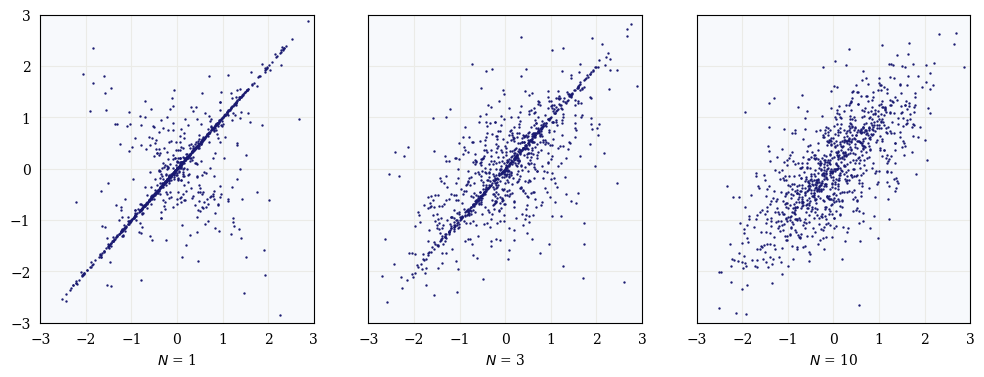

Despite their overwhelming success in modern machine learning, deep neural networks remain poorly understood from a theoretical perspective. Classical statistical wisdom dictates that overparameterized models (i.e., models with more degrees of freedom than data samples) should overfit noisy data and thus generalize poorly. Yet, even in cases in which deep neural networks fit noisy training data almost perfectly, they still exhibit good generalizability. This contradiction has highlighted a serious gap between the theory and practice of deep learning, motivating the need for a more complete theoretical framework.

An interesting result in the theoretical study of deep learning is the Neural Network Gaussian Process (NNGP), which shows the equivalence between neural networks and Gaussian processes (GPs). Indeed, [Neal [1996]](https://doi.org/10.1007/978-1-4612-0745-0_2) first showed that the prior distribution of functions represented by neural networks with a single hidden layer converges to a GP in the limit as the number of hidden units is taken to infinity[^fn1]. More recently, [Lee et al. [2018]](https://arxiv.org/pdf/1711.00165) extended this work to the case of deep neural networks.

In this blog post, I explain the NNGP, reviewing the works of both [Neal [1996]](https://doi.org/10.1007/978-1-4612-0745-0_2) and [Lee et al. [2018]](https://arxiv.org/pdf/1711.00165). I aim to clarify the mathematical argumments which lead to their results in a detailed and step-by-step fashion. Then, I show some empirical results which further exemplify the NNGP.

### Gaussian Processes

Informally, a GP is defined as a collection of random variables such that any finite collection of which take a multivariate Normal distribution. GPs can be thought of as an infinite-dimensional generalization of the multivariate Normal distribution, i.e., it is a distribution over functions with a continuous domain.

In machine learning, most supervised learning techniques take a parametric modeling approach, in which the task is to estimate the parameters of a function class given observations from the distribution[^fn2]&nbsp;. GPs, on the other hand, take a non-parametric Bayesian approach, in which minimal assumptions are made about the underlying distribution of data. This permits a more flexible model for characterizing said distribution, whether it be by regression, clustering, or otherwise.

For a more thorough explanation of GPs, I highly recommend [this blog post](https://distill.pub/2019/visual-exploration-gaussian-processes/).

### Notation

Consider an $L$-Layer neural network, with each layer $l$ consisting of $n_l$ hidden units. Let $\mathbf{x} = (x_1, \dots, x_{n_0})$ denote the input of the network. Then, the forward pass is defined by the following series of computations:

$$
\begin{align*}
\text{Input:} \ \ A_j^{(0)} &= x_j \\\\
\text{Pre-activation:} \ \ Z_j^{(l+1)} &= b_j^{(l)} + \sum_{i=0}^{n_l}w_{ji}^{(l)}A_i^{(l)} \\\\
\text{Post-activation:} \ \ A_j^{(l+1)} &= h \left( Z_j^{(l+1)} \right) \\\\
\text{Output:} \ \ f_j(\mathbf{x}; \theta) &= b_j^{(L)} + \sum_{i=0}^{n_L}w_{ji}^{(L)}A_i^{(L)}
\end{align*}
$$

Here,

* $Z_j^{(l)}$ denotes the $j$th hidden unit in layer $l$ before the activation function,
* $A_j^{(l)}$ denotes the $j$th hidden unit in layer $l$ after the activation function,
* $h(\cdot)$ is some nonlinear activation function,
* $w_{ji}^{(l)}, b_j^{(l)}$ denote the weights and biases at layer $l$, respectively,
* and $\theta$ is the vector of parameters in the network.

Often, we write the $f_j(\mathbf{x}; \theta)$ as $f_j(\mathbf{x})$, where it is implied that the output function is parameterized by the vector $\theta$. Similarly, each hidden unit is itself a function of the input **x**, so we can write, e.g., $A_j^{(l)} = A_j^{(l)}(\mathbf{x})$. It is also sometimes convenient to talk about computations involving entire layers instead of individual hidden units. As such, it is common to remove the subscript and denote an entire layer by, e.g., $A^{(l)}$, whereas the corresponding hidden units are denoted $A_j^{(l)}$.

For the sake of clarity, I will consider the case in which there is only one output unit. Thus, the function represented by the neural network can be written as $f(\mathbf{x})$, where I have removed the subscript $j$. The more general case is a fairly straightforward extension, in which each output unit $f_j(\mathbf{x})$ is itself a GP. The nuances arise in how the output unit is processed; e.g., a classification task in which the prediction is decided by taking the unit with the largest value, corresponding to a probability distribution under the softmax function.

Finally, if a function $f(x)$ is a GP with mean function $m(x)$ and covariance function $k(x, x^{\prime})$, I will denote this by $f(x) \sim \mathcal{GP}(m, k)$.

### Single-Layer Neural Networks as Gaussian Processes

First, we assume the weight and bias parameters are drawn i.i.d. from a Normal distribution, with $\mu_b = \mu_w = 0, \sigma_b^2 = 1$, and $\sigma_w^2 = 1/n_l$&nbsp;[^fn3]&nbsp;. Following the notation previously introduced, we begin with the computation of the pre-activation units in the first layer:

$$
Z_j^{(1)} = b_j^{(0)} + \sum_{i=1}^{n_0}w_{ji}^{(0)}x_i.
$$

Since each $w_{ji}, b_j$ is i.i.d. Normal, then $Z_j^{(1)}$ is i.i.d. Normal[^fn4]&nbsp;with mean

$$
\begin{align*}
\mathbb{E} \left[ Z_j^{(1)} \right] &= \mathbb{E} \left[ b_j^{(0)} + \sum_{i=1}^{n_0} w_{ji}^{(0)} x_i \right] \\\\
&= \mathbb{E} \left[ b_j^{(0)} \right] + \sum_{i=1}^{n_0} x_i \mathbb{E} \left[ w_{ji}^{(0)} \right] = 0,
\end{align*}
$$

where I've used the fact that the mean of each $w_{ji}, b_j$ is zero. Then, the distribution of the pre-activation units in the first layer can be wholly described by the covariance:

$$
\begin{align*}
& \mathbb{E} \left[ Z_j^{(1)}(\mathbf{x}) \\, Z_j^{(1)}(\mathbf{x}^{\prime}) \right] = \mathbb{E} \left[ \left( b_j^{(0)} + \sum_{i=1}^{n_0} w_{ji}^{(0)} x_i \right) \left( b_j^{(0)} + \sum_{i=1}^{n_0} w_{ji}^{(0)} x_i^{\prime} \right) \right] \\\\
    &= \mathbb{E} \left[ b_j^{(0)} \right]^2 + \mathbb{E} \left[ b_j^{(0)} \sum_{i=1}^{n_0} w_{ji}^{(0)} x_i \right] + \mathbb{E} \left[ b_j^{(0)} \sum_{i=1}^{n_0} w_{ji}^{(0)} x_i^{\prime} \right] + \sum_{i=1}^{n_0} \sum_{k=1}^{n_0} x_i \, x_k^{\prime} \mathbb{E} \left[ w_{ji}^{(0)} \right] \\\\
    &= \sigma_b^2 + \mathbb{E} \left[ b_j^{(0)} \right] \mathbb{E} \left[ w_{ji}^{(0)} \right] \sum_{i=1}^{n_0} (x_i + x_i') + \sigma_w^2 \sum_{i=1}^{n_0} \sum_{k=1}^{n_0} x_i \, x_k^{\prime}.
\end{align*}
$$

The second term is achieved as a result of the fact that the parameters are i.i.d., and since $\mu_b = \mu_w = 0$, it vanishes. Then, since $\sigma_b^2 = 1$ and $\sigma_w^2 = 1/n_l$, this becomes 

$$
\mathbb{E} \left[ Z_j^{(1)}(\mathbf{x}) \\, Z_j^{(1)}(\mathbf{x}^\prime) \right] = 1 + \frac{1}{n_0} \\, \mathbf{x}^\top \mathbf{x}^\prime.
$$

We can then compute the post-activation units via

$$
A_j^{(1)} = h \left( Z_j^{(1)} \right).
$$

The distribution of each $A_j^{(1)}$ for arbitrary activation functions is complicated, and in general it no longer follows a Gaussian distribution. However, we can say that each post-activation unit is i.i.d. Then, we compute the output of the single-layer nueral network via another affine transformation:

$$
f(\mathbf{x}) = b^{(1)} + \sum_{i=1}^{n_1} w_i^{(1)} \\, A_i^{(1)},
$$

and since each $A_i^{(1)}$ is i.i.d., then it follows from the Central Limit Theorem (CLT) that $f(\mathbf{x})$ takes a Normal distribution in the limit as $n_1 \to \infty$. Thus, for any finite collection of inputs **x**, the collection of outputs $f(\mathbf{x})$ will follow a multivariate Normal distribution; this is precisely the definition of a Gaussian process! It follows that

$$
f(\mathbf{x}) \sim \mathcal{GP}(m, k),
$$

where

$$
m(\mathbf{x}) = \mathbf{E} \left[ f(\mathbf{x}) \right] = 0,
$$

and

$$
\begin{align*}
    k(\mathbf{x}, \mathbf{x}^\prime) &= \text{Cov}{\left( f(\mathbf{x}), f(\mathbf{x}') \right)} \\\\
        &= \mathbb{E} \left[ \left( b^{(1)} + \sum_{i=1}^{n_1} w_{ji}^{(1)} A_i^{(1)}(\mathbf{x}) \right) \left( b^{(1)} + \sum_{i=1}^{n_1} w_{ji}^{(1)} A_i^{(1)} (\mathbf{x}') \right) \right] \\\\
        &= \sigma_b^2 + \sigma_w^2 \mathbb{E} \left[ A^{(1)}(\mathbf{x}), A^{(1)}(\mathbf{x}') \right] \\\\
        &= 1 + \frac{1}{n_1} C(\mathbf{x}, \mathbf{x}^\prime),
\end{align*}
$$

where I have introduced the covariance function $C(\mathbf{x}, \mathbf{x}^\prime)$ as in [Neal [1996]](https://doi.org/10.1007/978-1-4612-0745-0_2). This covariance function is often difficult to compute, and depends on the specified activation function. See [Comments on the Covariance Function](#comments-on-the-covariance-function) for further discussion.

### Deep Neural Networks as Gaussian Processes

The case for neural networks with arbitrary depth can be extended via an argument of mathematical induction. First, the base case follows from the previous section. Then, we assume that $Z_j^{(l)} \sim \mathcal{GP}(0, k^{(l)})$[^fn5] , and that each $Z_j^{(l)}$ are i.i.d. Hence, each $A_j^{(l)}$ are i.i.d. as well. Then, we can compute

$$
Z_j^{(l+1)} = b_j^{l} + \sum_{i=1}^{n_l}w_{ji}^{(l)}A_j^{(l)}.
$$

Once again, since each $A_j^{(l)}$ are i.i.d., then as $n_l \to \infty$, the CLT implies that $Z_j^{(l+1)}$ will take a Normal distribution. Thus, $Z_j^{(l+1)}$ is also a GP, and we have our result.

Specifically, the mean function of the corresponding GP is given by $m(\mathbf(x)) = \mathbb{E} \left[ Z_j^{(l+1)} \right]$, and since the weights and biases have mean zero, then $m(\mathbf{x}) = 0$. Then, we have

$$
Z_j^{(l+1)} \sim \mathcal{GP}(0, k^{(l+1)}),
$$

where

$$
\begin{align*}
k^{(l+1)}(\mathbf{x}, \mathbf{x}^\prime) &= \mathbb{E} \left[ Z_j^{(l+1)} (\mathbf{x}) \\, Z_j^{(l+1)}(\mathbf{x}^\prime) \right] \\\\
&= 1 + \frac{1}{n_l} \\, C\left( A^{(l)}(\mathbf{x}) A^{(l)}(\mathbf{x}^\prime) \right).
\end{align*}
$$

The covariance function of the corresponding GP at each layer is defined recursively, and I restrict discussion of the covariance function to the single-layer case. This is addressed in the following section.

### Comments on the Covariance Function

As was previously alluded to the computation of the covariance function is often difficult to evaluate, and depends on the specific architecture and choice of activation functions in the neural network. Computing the covariance function involves integrating over the distributions of the weights and biases for each pair of training samples. For many architectures, this requires sophisticated numerical integration techniques, and is often not practical from a computational perspective. Furthermore, this becomes increasingly challenging with larger datasets.

However, in the case of a single hidden layer, certain choices of activation functions do yield analytic covariance functions. [Williams [1996]](https://proceedings.neurips.cc/paper_files/paper/1996/file/ae5e3ce40e0404a45ecacaaf05e5f735-Paper.pdf) gives such an example; the error function, defined by

$$
\text{erf } x = \frac{2}{\sqrt{\pi}} \int_0^x e^{-t^2}dt.
$$

The error function is related to the cumulative distribution function for the Gaussian distribution. Furthermore, it closely resembles the tanh function, making it a reasonable choice for an activation function in a neural network. The corresponding covariance function is then given by

$$
\mathbb{E} \left[ \text{erf } (\mathbf{x}) \\, \text{erf } (\mathbf{x}^\prime) \right] = \frac{2}{\sqrt{\pi}} \sin^{-1} \left( \frac{2\mathbf{x}^\top \Sigma \mathbf{x}^\prime}{\sqrt{ \left( 1 + 2\mathbf{x}^\top \Sigma \mathbf{x} \right)  \left( 1 + 2 \mathbf{x}^{\prime\top}\Sigma \mathbf{x}^\prime \right) } } \right),
$$

where $\Sigma$ denotes the covariance matrix of the input-to-hidden layer weights ([Williams [1996]](https://proceedings.neurips.cc/paper_files/paper/1996/file/ae5e3ce40e0404a45ecacaaf05e5f735-Paper.pdf)). Note that this covariance function is not stationary, i.e., it is not translation invariant, which is often a nice property in kernel functions for GP regression.

### Empirical Results

<a href="#fig1">Figure 1</a> shows the distribution over network priors for an increasing number of hidden units (network priors being the function represented by the network at initialization, before training). Each point represents a neural network prior (i.e., no training) with a single hidden layer, a single input, and a single output, with 1, 3, and 10 tanh hidden units, respectively from left to right. The parameters were drawn from a Normal distribution with $\sigma_b^{(0)} = \sigma_w^{(0)} =5$, $\sigma_b^{(1)} = 0.1$, and $\sigma_w^{(1)} = 1/\sqrt{N}$, where $N$ is the number of units in the hidden layer. The horizontal axis is the output of the network when the input is -0.2; the vertical axis is the output of the network when the input is 0.4.

  
  <figcaption>Figure 1: Convergence of prior to Gaussian process for single-input network. Results reproduced from <a href=https://doi.org/10.1007/978-1-4612-0745-0_2>Neal [1996].</a></figcaption>

Recalling the definition of a GP, if $f \sim \mathcal{GP}$, then $f(-0.2)$ and $f(0.4)$ take a joint bivariate Normal distribution. It can be seen that as the size of the hidden layer increases, the distribution of priors converges to a bivariate Normal distribution.

<a href="#fig2">Figure 2</a> shows the training process of an ensemble of 50 neural networks. Each pink line represents a single neural network in the ensemble, and the dark red line shows the mean of the ensemble. The shaded blue region displays the interval of two standard deviations about the mean.

   
  <figcaption>Figure 2: Ensemble of neural networks as a Gaussian process</figcaption>

At initialization, the ensemble is a zero-mean Gaussian process. The ensemble converges to the NNGP, which is equivalent to performing inference with a Gaussian process with corresponding covariance function as defined previously.

All of the code used to make these plots can be found at [github.com/wvirany/NNGP](https://github.com/wvirany/NNGP).

### References and Further Reading

1. Radford M. Neal. "[Priors for Infinite Networks.](https://doi.org/10.1007/978-1-4612-0745-0_2)" Bayesian Learning for Neural Networks. Springer, New York, NY, 1996. 29-53.

2. Lee & Bahri et al., "[Deep neural networks as Gaussian processes](https://arxiv.org/pdf/1711.00165)" ICLR 2018

3. Christopher Williams, "[Computing with infinite networks.](https://proceedings.neurips.cc/paper_files/paper/1996/file/ae5e3ce40e0404a45ecacaaf05e5f735-Paper.pdf)" NeurIPS 1996

4. Weng, Lilian. "[Some math behind the neural tangent kernel.](https://lilianweng.github.io/posts/2022-09-08-ntk/)" Sep 2022

5. Görtler, et al., "[A Visual Exploration of Gaussian Processes](https://distill.pub/2019/visual-exploration-gaussian-processes/)", Distill, 2019.

[^fn1]: Here, "the prior distribution of functions represented by neural networks" refers to the fact that a neural network represents a function, and at initialization, the parameters which characterize that function are each drawn from a distribution. Hence, the function itself is drawn from a joint distribution of all its parameters.
[^fn2]: For example, this correspondings to solving the least squares regression problem, in which the function class consists of all affine functions, and the parameters are the slope and intercept of the line which best fits some set of observations.
[^fn3]: As we will see later, it is necessary to define the variance of the weight parameters as $\sigma_w^2 = 1/n_l$ so that when we take the number of hidden units to infinity, the sum over all these units will converge.
[^fn4]: This follows from the fact that an affine transformation of i.i.d. Normal random variables is itself i.i.d. Normal.
[^fn5]: Note that the covariance function of the GP for the units in each layer depends on the activation functions in all the previous layers.