I recently came across a paper from De Ath et al. (2020) evaluating different prior means for Gaussian processes (GPs) with some interesting implications for performance in Bayesian optimization (BO) [1]. Specifically, they looked at the behavior in BO under different choices of the constant prior mean parameter $c$, setting this equal to the mean, max, and min of the observed data. They also looked at several other non-constant means. However, they importantly did not consider the case in which we choose $c$ by optimizing the marginal log-likelihood (MLL) of the data, which is arguably the most common way of choosing GP hyperparameters.

In this blog, I extend the results from De Ath et al. to also evaluate BO performance on several tasks when using the maximum likelihood estimate (MLE) for the prior mean. De Ath et al. also tested different choices of the prior mean on various "real-world" datasets, showing that the best choice of prior mean is very problem-dependent. Since I am primarily interested in the application of BO to molecular discovery, I also test different choices of the prior mean on various molecular optimization tasks. Finally, I try out an idea in which a low-fidelity oracle for binding affinity is used as the prior mean for a higher-fidelity oracle in an attempt to incorporate domain knowledge into the prior of the surrogate model.


## The prior mean

The prior mean doesn't get much attention in the GP literature. This is typically supported by claims that the primary object determining the behavior of a GP is the kernel function. While I agree that choosing the kernel function is arguably the most important modeling decision when using GPs, I think it's still important to consider how the prior mean will affect predictions and consequently performance in BO.

In particular, the prior mean determines the extrapolation of a GP. To see this, suppose we have some dataset of observations $\mathcal{D} = (\X, \y)$, and consider the form of the posterior mean:[^fn1]
$$
\mu_\mathcal{D}(\x) = \mu(\x) + K_\ast\T \left( K + \sigma_n^2 I\right)\inv (\y - \mathbf{m})
$$
When $K_\ast$ is *small*---i.e., when $\x$ and the previously observed data $\X$ have *low covariance*---the predictions revert to the prior mean $\mu(\x)$. In other words, the prior mean determines the *extrapolation* of the model. This suggests that the prior mean will have an important effect on the exploratory behavior in BO.

## Computing the prior mean

The form of the constant mean function is just

$$
\mu(\x) = c
$$

for any $\x$ in our design space $\mathcal{X}$.

The authors of the original study state that typical packages implement a default value of $c$ as the mean of the training data observations $\y$. So the default value of $c$ for observations $\{(\x_i, y_i)\}_{i=1}^n$ would be

$$
c = \frac{1}{n}\sum_{i=1}^n y_i.
$$

However, this is not the value that's typically used. As a running example, consider the following dataset:[^fn2]


```python
train_X = torch.tensor([0.1, 0.15, 0.75]).unsqueeze(-1)
train_y = torch.tensor([0.6, 0.6, 0.65]).unsqueeze(-1)
```

<div id="fig1" class="figure">
   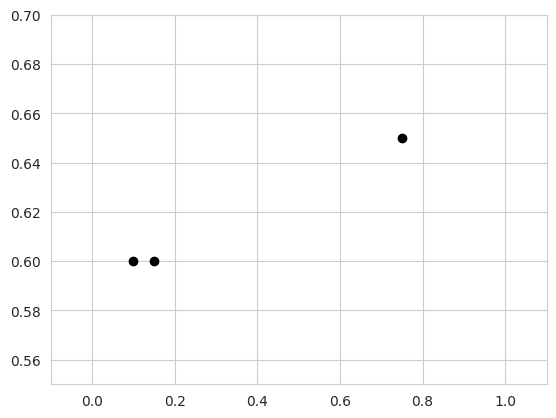
</div>

We have two points which have the same output value $y = 0.6$, and one point with $y = 0.65$. Instantiating a `SingleTaskGP` model on this data gives the following:
```python
from botorch.models import SingleTaskGP

model = SingleTaskGP(train_X, train_y)

c = model.mean_module.constant
print(c)
```
```
Parameter containing:
tensor(0., requires_grad=True)
```

The `SingleTaskGP` model automatically standardizes the output to have zero mean and unit variance:
$$
\bar{\y} = \frac{\y - \bar{\mu}}{\bar{\sigma}},
$$
where $\bar{\mu}$ and $\bar{\sigma}$ are the sample mean and standard deviation of the observations. In this space, the initial value for $c$ is given by
$$
\bar{c} = \frac{1}{n}\sum_{i=1}^n\bar{y}_i = 0.
$$
We can invert the transformation to get $c$ in the original output space:
$$
c = \bar{c} \cdot \bar{\sigma} + \bar{\mu}
$$
```python
print(model.outcome_transform.untransform(c)[0])
```
```
tensor([[0.6167]], grad_fn=<AddBackward0>)
```

This does match the mean of the observed data. However, if we train the model as is done in typical workflows, we get the following mean parameter:
```python
import gpytorch
from botorch.fit import fit_gpytorch_mll

mll = gpytorch.mlls.ExactMarginalLogLikelihood(model.likelihood, model)
fit_gpytorch_mll(mll);

print(c)
```
```plaintext
Parameter containing:
tensor(0.3322, requires_grad=True)
```

This is, of course, no longer equal to the (standardized) mean of the observed data. Instead, this is the MLE for $c$ which is achieved by optimizing the MLL.


## Optimizing the MLL

The constant parameter in the `ConstantMean` module in GPyTorch (also used by `SingleTaskGP`) is a learnable hyperpameter as denoted by `requires_grad=True`. Thus, it is learned when we optimize the MLL by calling `fit_gpytorch_mll()`. But what is the maximum likelihood solution for $c$?

We can write the likelihood of our data in terms of $c$ as

$$
p(\y \mid \X) = \Norm(\y \mid c\mathbf{1}, \bSigma)
$$

for some general covariance matrix $\bSigma$. Then, treatng other hyperparameters as fixed, we can write the MLL w.r.t. $c$ as

$$
\mathcal{L}(c) = -\frac{1}{2} \log \lvert \bSigma \rvert - \frac{1}{2} (\y - c\mathbf{1})\T\bSigma\inv(\y- c\mathbf{1}).
$$

We can find the MLE by taking the derivative and setting it equal to zero:

$$
\begin{align*}
\frac{\partial \mathcal{L}}{\partial c} &= \frac{\partial}{\partial c} \left( \y\T\bSigma\inv\y - 2c\mathbf{1}\bSigma\inv\y + c^2\mathbf{1}\T\bSigma\inv\mathbf{1} \right) \\\\[4pt]
&= -2 \mathbf{1}\T \bSigma\inv\y + 2c \mathbf{1}\T \bSigma\inv\mathbf{1}
\end{align*}
$$

Thus, the MLE for $c$ is given by

$$
c = \frac{\mathbf{1}\T \bSigma\inv \y}{\mathbf{1}\T \bSigma\inv \mathbf{1}}.
$$

This is not the arithmetic mean of the observations $\y$. Instead, it is a weighted average where terms are weighted by their covariance with other data points. To see this, let $\bLambda = \bSigma\inv$ denote the precision matrix, with corresponding elements $\lambda_{ij}$. Then, we can write the MLE as
$$
c = \frac{\sum_{i,j}\lambda_{ij}(y_i + y_j)}{\sum_{i,j}\lambda_{i,j}}.
$$
This considers the sum between all pairs of points, weighted by their precision. When the covariance between two points $\x_i, \x_j$ is high, the corresponding element of the precision matrix $\lambda_{i, j}$ will be low. Thus, multiple points which are correlated according to the covariance matrix will contribute less to computing $c$ than points which are independent from other observations.

Note that if the observations are independent, i.e., $\bSigma = \I$, then this is just the unweighted average. Also, note that we learn this parameter via gradient-based optimizers (e.g., Adam) rather than computing it in closed form, but since the loss with respect to $c$ in this case is convex, these optimizers have no trouble converging to the solution.

Let's verify this matches the value in our model:
```python
ones = torch.ones_like(train_y)

# Compute prior covariance
K_prior = model.covar_module(train_X).evaluate()
noise_covar = model.likelihood.noise
Sigma = K_prior + noise_covar * torch.eye(len(train_X))

# Compute precision matrix
precision = torch.linalg.inv(Sigma)

# Compute constant mean parameter
c = ((ones.T @ precision @ y) / precision.sum()).item()
print(round(c, 4))
```
```
0.6263
```

```python
print(model.outcome_transform.untransform(model.mean_module.constant)[0])
```
```
tensor([[0.6263]], grad_fn=<AddBackward0>)
```
These appear to match!

Now let's compare a GP where $c$ is equal to the MLE vs. one with $c$ equal to the observation mean:

<div style="display: flex; gap: 16px; justify-content: center;">
  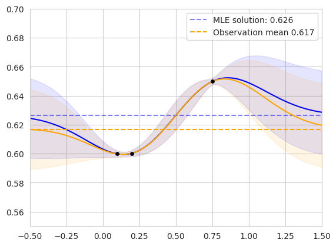
  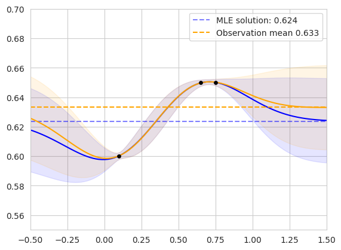
</div>

The figure on the left shows the two posterior GPs fit on our original dataset. The blue curve shows the posterior predictive distribution of the GP whose prior mean is the MLE, while the orange curve shows the GP whose prior mean is the observation mean. The mean values are shown as horizontal dashed lines. The lengthscale and noise variance hyperparameters of each model were jointly fit via MLL optimization. The models agree for points in the domain with high correlation to the observed data, and diverge in regions far from existing observations.

The figure on the right shows the same setup on an alternate dataset. We can see that the observation mean is biased toward the clustered points, while the MLE solution considers the correlation between similar observations. In the following section, I'll explore how these differences affect performance in BO.


## Revisiting the role of the prior mean in Bayesian optimization

The authors of the original study showed a figure which I found to be somewhat surprising: choosing different values of $c$ results in very different forms of the expected improvement (EI) acquisition function. Importantly, however, they did not include the MLE in their set of prior means, which I show in the following figure:

<div id="fig3" class="figure">
   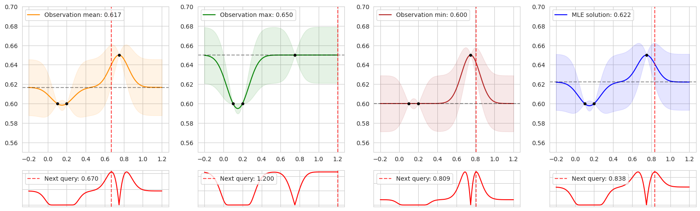
</div>

The figure shows the posterior predictive distribution for a GP with the constant parameter set to four different values: the mean, max, and min of the observed data, as well as the MLE. The second row shows the corresponding acquisition values computed by EI, and the red vertical dashed lines show the maximizer of the acquisition function---the next point to be queried during BO.

In regions close to the training data, EI looks similar in each case. However, away from previous observations, EI is entirely determined by the prior mean, resulting in different choices of the next query.

**This has an important implication for BO:** as the policy gathers data and tends to exploit promising modes of the objective function, the observations will be biased toward high objective values. This is the whole premise of BO---we hope that it performs better than randomly acquiring data points, so ideally the mean of the acquired data should be higher than the true mean of the objective function. Thus, the observation mean will be biased toward high values.


## Comparing prior means

I compare the four different prior means shown in several settings. First, I  evaluate the four settings on eight different synthetic functions with up to 10 dimensions following the experimental setup from De Ath et al. Then, I also evaluate each mean function when optimizing for various molecular properties: QED, AutoDock Vina, and MM/GBSA scores. I primarily investigate the behavior when using EI as the acquisition function, but I also include additional results for UCB and Thompson sampling for the synthetic functions in [Additional Results](#additional-results).

### Synthetic test functions

I compare each prior mean on eight synthetic test functions: Branin and Goldstein-Price ($d=2$), Shekel ($d=4$), Ackley ($d=5$), Hartmann ($d=6$), and Michalewicz, Rosenbrock, and Styblinski-Tang ($d=10$). The following figure shows the simple regret using EI across all eight test functions. The dark line and shaded regions correspond to the median and inner-quartile ranges across 50 random seeds.


<div id="fig4" class="figure">
   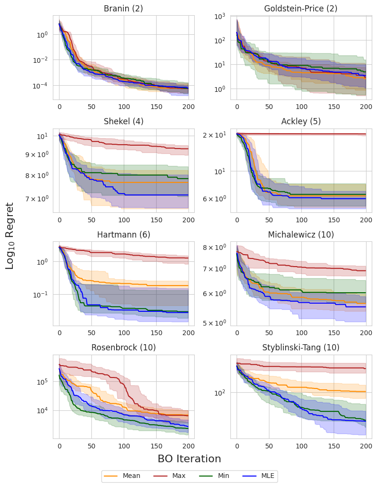
</div>


The authors of the original study noted that the observation minimum typically outperformed the observation mean in high dimensions, which was attributed to the non-exploratory behavior of this prior mean. This could be due to the fact that, as we acquire more data, the observation mean becomes biased toward high values, and places a large prior on unseen regions, resulting in more exploratory behavior. This can be a problem in high-dimensional domains where the search space grows exponentially with respect to the dimension and efficient exploration becomes infeasible.

Interestingly, the MLE solution does not appear to suffer from this problem, consistently matching or outperforming the observation minimum across all objectives. This suggests that it is a reasonable out-of-the-box choice for the mean when little or no prior knowledge about the objective function is known.


### Molecular optimization

In this section, I compare the four choices of prior mean on three molecular optimization objectives: QED, AutoDock Vina docking scores, and MM/GBSA-based binding affinity predictions. I am using a dataset from Andersen et al. (2025) which contains roughly 60,000 analogs of experimentally validated Mcl-1 inhibitors [2]. I record the simple regret and retrieval rate---the proportion of the top-1% of the dataset discovered---over 500 iterations, averaged across 5 random seeds.

<div id="fig5" class="figure">
   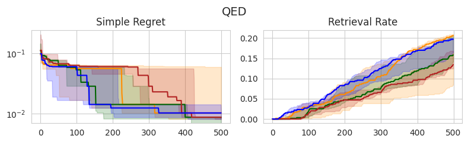
   <br>
   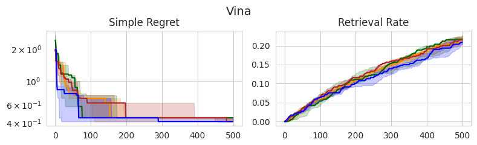
   <br>
   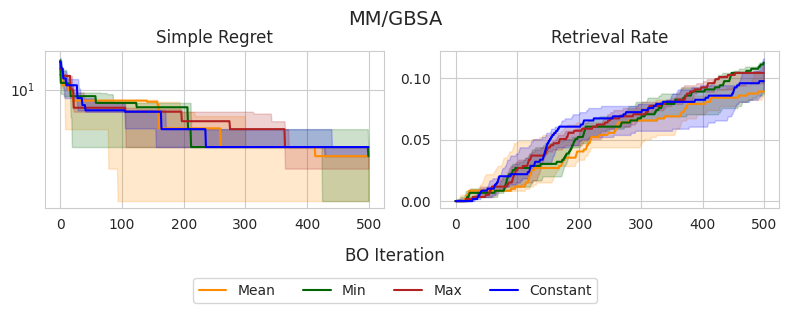
</div>

Similar to the experiments on synthetic test functions, it appears that there is little difference between the observation min and MLE in terms of simple regret, with the observation mean and max tending to perform slightly worse in earlier stages, yet eventually catching up. However, there don’t appear to be any statistically significant differences between the methods, as all IQRs tend to overlap.

Interestingly, these same trends don't appear to translate consistently to the retrieval rate, which is arguably a better-suited metric for molecular discovery. In the case of QED, the observation mean and MLE outperform the alternatives, although this doesn't appear to translate to Vina and MM/GBSA scores, in which there are no clear winners. Overall, the MLE once again tends to perform the best or as well as the best-performing method in each setting, further supporting that this is a good out-of-the-box choice.


## What about other prior means?

So far I have focused on *constant* prior means, and different ways of computing the constant parameter $c$. Of course, we are not restricted to modeling with constant means. Indeed, the authors of the original study test several other forms of the mean function, including linear and quadratic functions, as well as random forests and RBF networks. However, these methods did not seem to provide clear advantages across tasks.

I am typically skeptical of the ability of ML-based methods to accurately generalize to regions in the domain with little data, which is exactly the role of the prior mean. As Garnett says, "extrapolation without strong prior knowledge can be a dangerous business" [3]. However, it may be possible to incorporate such domain knowledge to improve OOD generalization. For example, in optimizing a physics-based objective, perhaps we can use a first-order approximation as the prior mean.

To this end, I attempt to improve the performance of optimizing binding affinity when using a low-fidelity approximation as the prior mean. Molecular dynamics-based methods provide a high-fidelity proxy for binding affinity compared to docking-based methods. Thus, perhaps we can use AutoDock Vina scores as the prior mean when optimizing MM/GBSA.  Ideally, this should speed up the discovery of high-scoring candidates according to MM/GBSA. I test this choice of prior mean against a constant prior mean given by the MLE. The results are shown below:


<div id="fig6" class="figure">
   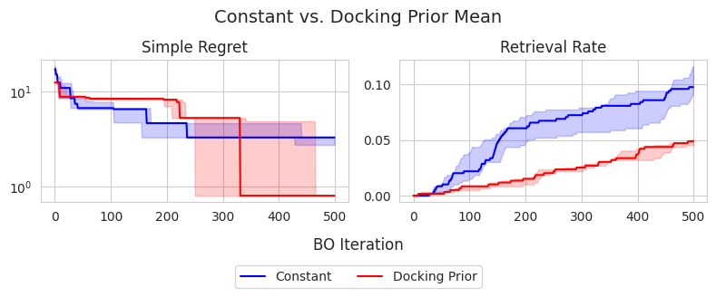
</div>


Interestingly, the constant prior mean is actually more effective in identifying top-1% candidates in the dataset, achieving approximately 10% retrieval rate on average, compared to the docking prior mean which achieves roughly 5%. Interestingly, the docking prior mean appears to achieve a better simple regret at 500 iterations, suggesting that it could be more effective in identifying the global maximum, despite not achieiving good exploration compared to the constant prior mean. However, the differences in terms of simple regret do not appear to be statistically significant.

I also perform t-SNE on the Morgan fingerprints of the dataset to understand the objective landscapes and exploratory behavior of each model. The figure below shows the resulting t-SNE projection of the dataset, colored by both MM/GBSA scores (left) and Vina scores (right). The points are binned based on the percentile of their scores.

<div id="fig7" class="figure">
   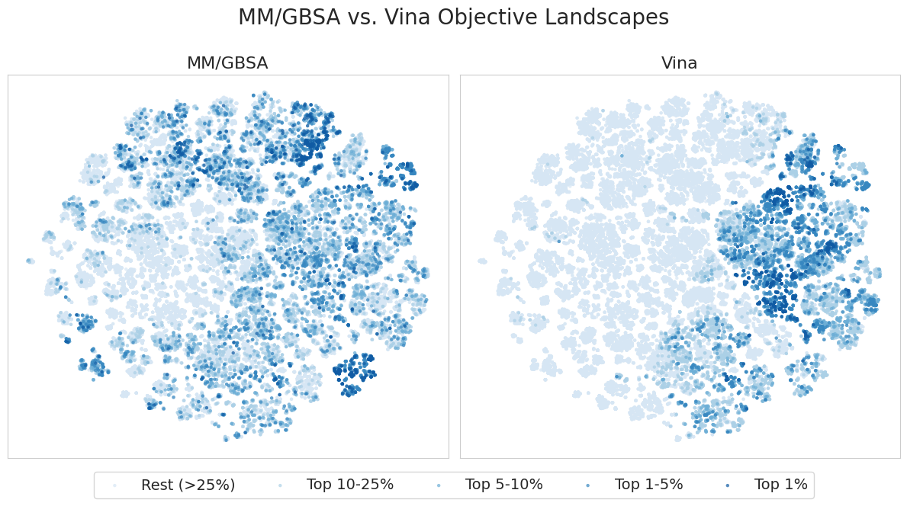
</div>

Interestingly, it appears that high MM/GBSA scores are spread out among different clusters of candidates, while high Vina scores appear to be restricted to a few distinct clusters. This suggests that MM/GBSA is inherently multi-modal in fingerprint space, providing a more complex and difficult objective landscape. This agrees with the results in the [Molecular optimization](#molecular-optimization) section, where we were able to achieve a higher retrieval rate in terms of Vina scores compared to MM/GBSA in 500 iterations.

Additionally, the figure below shows the candidates selected during BO for a single seed when using the constant vs. docking prior means. Darker points correspond to those selected at later iterations of BO.

<div id="fig8" class="figure">
   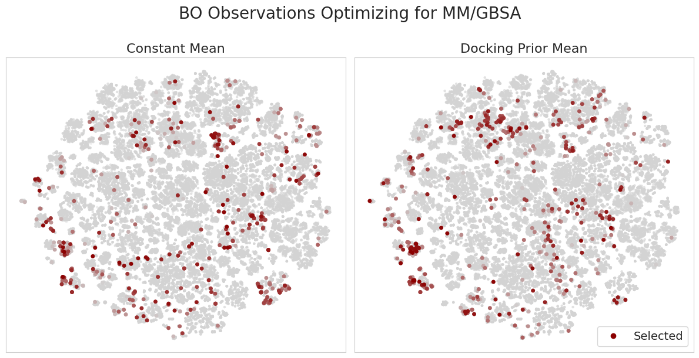
</div>

It's interesting to consider how the docking prior mean model updates its belief upon making new observations. For example, in regions with high Vina scores, yet low MM/GBSA scores, the model makes relatively few observations. Moreover, the model learns to explore regions with low Vina scores, yet high MM/GBSA scores. This is an important capability and addresses a concern in typical filtering-based approaches in drug discovery where we only proceed with candidates which appear promising according to low-fidelity oracles. This introduces a "false negatives" problem, in which we skip candidates which in reality show promise according to more accurate experiments.

Despite this method being outperformed by the constant prior mean, the success of any method tends to be problem-specific, and there could be certain targets / datasets for which docking scores provide a meaningful prior for higher-fidelity binding affinity approximations. Moreover, this could provide an interesting avenue for multi-fidelity BO, which I plan to explore further in the future.

Thanks for reading!


## References

1. George De Ath, Jonathan E. Fieldsend, and Richard M. Everson. “What do you Mean? The Role of the Mean Function in Bayesian Optimisation”. Proceedings of the 2020 Genetic and Evolutionary Computation Conference Companion. 2020

2. Lucas Andersen et al. “Accelerating ligand discovery by combining Bayesian optimization with MMGBSA-based binding affinity calculations” (2025).

3. Roman Garnett. Bayesian Optimization. Cambridge University Press, 2023.

## Additional results

Here I also include the results for UCB and Thompson sampling on the synthetic test functions. Similar trends can be observed when using EI.


#### UCB
<div id="fig9" class="figure">
   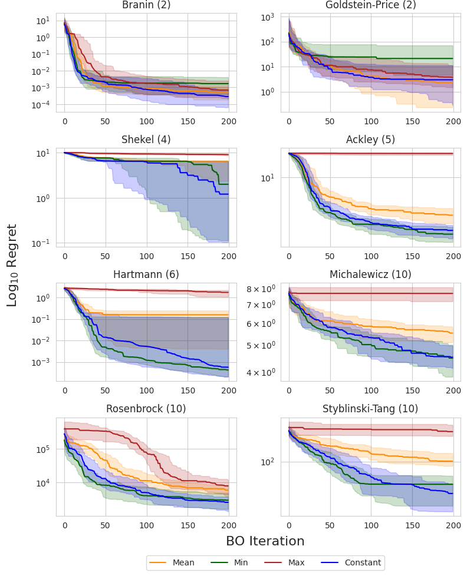
</div>

<br>

#### Thompson sampling
<div id="fig10" class="figure">
   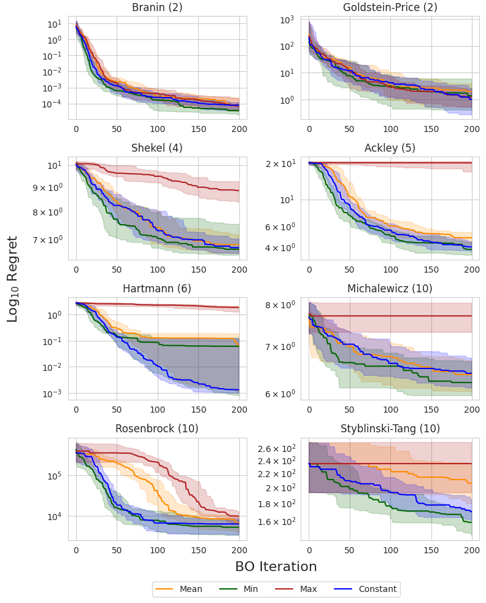
</div>


[^fn1]: If this looks unfamiliar, I derived it in a [previous post](https://wvirany.github.io/posts/gp_intro/)!

[^fn2]: This is meant to mimic the example dataset from the paper; however, I treat the problem as *maximization*.

[^fn3]: It's interesting to note that we still observe this behavior, even though we use the log-normal lengthscale prior from Hvarfner et al. (2024). Although the dimensionality of the tested objective functions may not be high enough to exhibit a meaningful effect of this prior.
